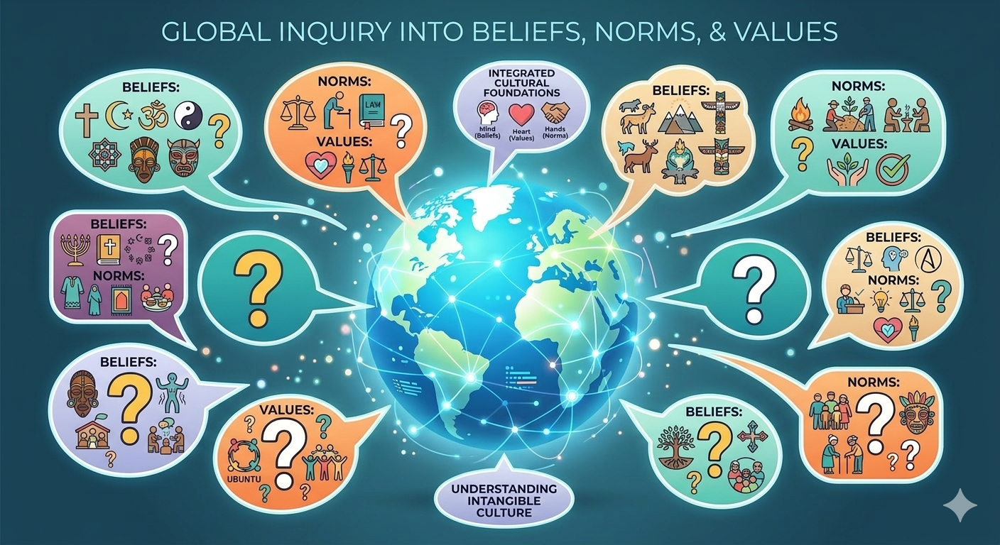
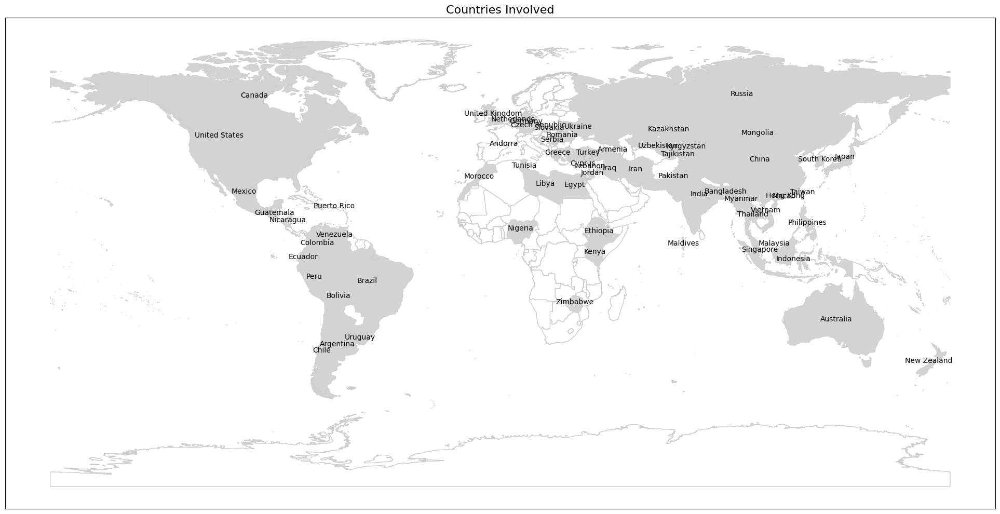

# Do AI Models Really Understand Cultures? Testing LLMs on the World's Values

## Part 1: The Cultural Turing Test

Imagine asking ChatGPT to roleplay as a typical person from Japan, then from Brazil, then from Nigeria. Would the AI give culturally authentic answers? Or would it reveal the same Western-centric worldview, just dressed up in different national costumes?

This isn't just a thought experiment—it's a question with real consequences. As AI systems become advisors, decision-makers, and cultural translators, we need to know: **Can large language models authentically represent the diverse values, beliefs, and moral intuitions of people around the world?**

*Figure 1: Can AI models capture the rich diversity of human values across cultures?*

---

## Why This Matters: The Stakes of Cultural Representation

When a language model is trained on billions of words from the internet, it absorbs patterns—not just grammar and facts, but **implicit cultural worldviews**. The problem? Most training data comes from English-speaking, Western sources. This creates a cultural echo chamber.

Consider these scenarios:

**Healthcare**: An AI assistant helping doctors in rural India might give advice that's technically correct but culturally tone-deaf, ignoring local beliefs about family involvement in medical decisions.

**Education**: A tutoring chatbot might use examples and teaching styles that work well in California but completely miss the mark in South Korea, where educational culture emphasizes different values.

**Policy**: Governments increasingly use AI to understand public opinion. If the AI systematically misrepresents non-Western populations, policy decisions could be based on flawed cultural intelligence.

The question isn't academic—it's about whether AI can be a fair representative of humanity's diversity, or whether it will amplify existing biases at scale.

---

## The Research Question

This project asks three specific questions:

**1. How accurately can LLMs represent country-level cultural values?**
- Can GPT-5 answer survey questions "as a typical person from Country X" in ways that match real responses from that country?

**2. Do different prompting strategies affect cultural accuracy?**
- Does asking the model to "think step-by-step" (chain-of-thought) improve authenticity?
- Does giving the model access to web search help it ground answers in real cultural knowledge?

**3. What patterns emerge in the model's errors?**
- Do errors cluster by geographic region or cultural similarity?
- Which types of questions get better or worse with enhanced reasoning?

---

## The Dataset: A Global Mirror

To answer these questions, we need ground truth—real data about what people actually believe across cultures. Enter the **World Values Survey (WVS)**, one of the largest global research projects on cultural values and beliefs.

### What is the World Values Survey?

- **Scope**: Wave 7 covers 66 countries from 2017-2022
- **Respondents**: Nearly 90,000 people surveyed
- **Coverage**: ~75% of the world's population
- **Questions**: 900+ items covering everything from trust in institutions to attitudes about family, work, politics, religion, and social change

This isn't just demographic data—it's a snapshot of **what matters to people** around the world.

*Figure 2: Geographic coverage of the World Values Survey Wave 7 (2017-2022). The survey spans every inhabited continent, capturing voices from Western democracies, authoritarian states, post-conflict societies, and rapidly developing economies.*

---

## What Makes This Study Different

Previous work on AI cultural bias often focuses on:
- **Language differences**: Can models translate accurately?
- **Stereotype detection**: Does the model say offensive things about groups?
- **Geographic knowledge**: Can it name capitals and landmarks?

These are important, but they miss something deeper: **values and worldviews**.

This study is different because it:

1. **Tests implicit cultural knowledge**: Not just facts, but beliefs, priorities, and moral intuitions
2. **Uses real survey data**: Compares AI responses to actual human populations, not researcher intuitions
3. **Examines prompting strategies**: Explores whether enhanced reasoning helps or hurts cultural authenticity
4. **Analyzes error patterns**: Looks at which cultures get misrepresented and why

---

## The Journey Ahead

Over the next sections, we'll walk through:

- **Building a cultural fingerprint detector**: Training machine learning models to recognize country-specific value patterns (Part 2)
- **The three-way LLM experiment**: Testing simple prompting, chain-of-thought, and web-search agents across 66 countries (Part 3)
- **When reasoning helps (and when it hurts)**: Analyzing which questions improve with enhanced prompting and which degrade (Part 4)
- **The geography of AI errors**: Discovering that LLM mistakes cluster into macro-cultural regions (Part 4)
- **What this means for AI fairness**: Implications for building more culturally aware systems (Part 5)

This is part detective story, part technical deep-dive, and part global tour. Let's begin.

---

**Navigation**: [Part 2: Building Ground Truth →](blog_part2_ground_truth.md)

