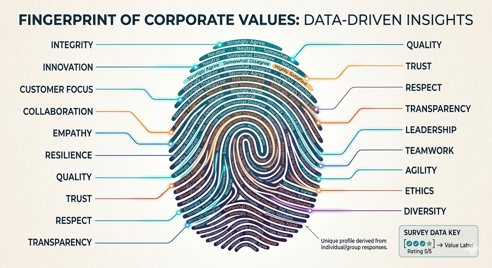
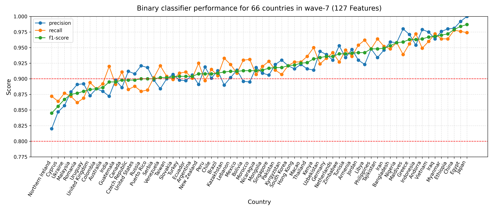
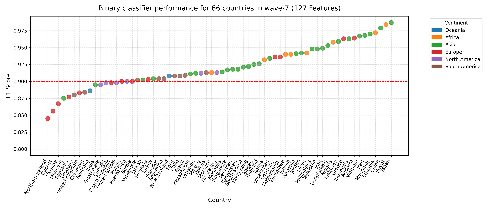
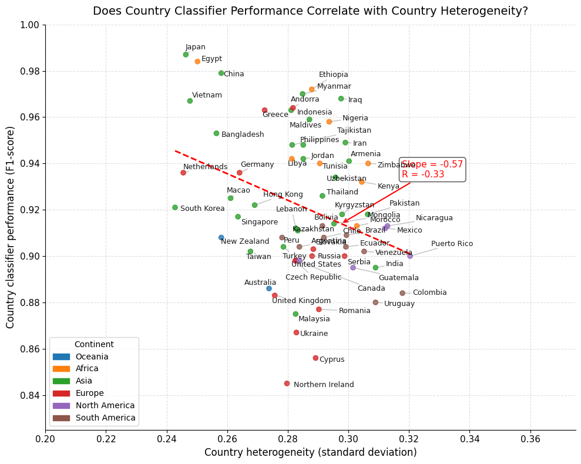

# Part 2: Building the Cultural Fingerprint Detector

Before we can test whether AI understands cultures, we need to establish **what authentic cultural patterns look like**. Think of this as creating a "fingerprint scanner" that can recognize the unique value signatures of different countries.

------------------------------------------------------------------------

**Code Implementation:** Available at [0.ml_data_preparation.ipynb](https://drive.google.com/file/d/1Fy_EL7dIaqZfEWbdnrow7tQ6H-NesXu0/view?usp=sharing) and [1.ml_byctry.ipynb](https://drive.google.com/file/d/1TxhajfUe8jGl9GCqE_IUNb2AmfBUSGz4/view?usp=sharing)

## The Challenge: Are Countries Culturally Distinctive?

Here's a fundamental question: Can you actually tell where someone is from based on their values and beliefs?

If people around the world answered survey questions randomly, we'd see no country-specific patterns. But if cultural environments truly shape how people think, we should be able to **predict someone's nationality from their survey responses with high accuracy**.

This becomes our ground truth test: **Train a machine learning classifier to identify countries based on value patterns. If it works well, we know cultural signatures are real and distinctive.**

 *Figure 3: Every country has a unique "fingerprint" composed of its collective patterns across 127 cultural value dimensions.*

------------------------------------------------------------------------

## Step 1: Preparing the Data

### From 900 Questions to 127 Cultural Values

The full WVS has 900+ questions, but not all are suitable for cross-cultural comparison:

-   **Country-specific items removed**: Questions like "Do you trust your national parliament?" can't be compared across countries with different political systems
-   **50% response threshold**: Only included questions where at least half of respondents in each country provided valid answers
-   **127 items selected**: The final set covers diverse cultural domains

**The 127-item cultural profile includes:**

-   Trust in institutions (police, government, press, UN).

-   Family and social values (importance of family, duty to parents, gender roles).

-   Political attitudes (interest in politics, participation, democracy preferences).

-   Moral judgments (views on abortion, divorce, homosexuality, corruption, violence).

-   Priorities (economy vs. environment, freedom vs. security, religious vs. secular).

-   Life satisfaction and subjective well-being.

-   Religious practice (frequency of attendance, prayer).

-   Media consumption patterns.

-   Immigration attitudes.

### Data Cleaning Strategy

The WVS codes missing responses as negative values (-1 = Don't know, -2 = No answer, etc.). We couldn't just delete these—that would create different feature sets for different countries.

**Solution**: Replace missing values with **country-specific means** for each question.

Why country-specific? Because what people "typically think" varies by culture. The average view on gender roles in Sweden should fill missing Swedish responses, not the global average.

### Normalization

All 127 features were scaled to \[0, 1\] using MinMax scaling using their original possible scale as range.

This ensures no single question dominates just because it uses a larger numeric scale.

**Final dataset**: Individual-level responses for \~90,000 people across 66 countries, each represented by 127 normalized cultural value features.

------------------------------------------------------------------------

## Step 2: Training the Cultural Fingerprint Classifier

### The Classification Setup

For each of the 66 countries, we trained a **binary logistic regression classifier**:

-   **Positive class**: All survey respondents from Country X
-   **Negative class**: Randomly sampled respondents from all other 65 countries (matched sample size for balance)
-   **Features**: 127 normalized value items
-   **Split**: 80% training, 20% testing
-   **Task**: Given a person's survey responses, predict whether they're from Country X or not

 *Figure 4: For each country, a binary classifier learns to distinguish its cultural signature from all others. High accuracy means the country has a distinctive value profile.*

### Why Logistic Regression?

We chose logistic regression because:

1\. **Interpretable**: Coefficients show which values are most distinctive for each country

2\. **Robust**: Works well with high-dimensional data and doesn't overfit easily

3\. **Fast**: Can train 66 models quickly

4\. **Probabilistic**: Outputs confidence scores, not just yes/no predictions

------------------------------------------------------------------------

## Step 3: Results—Countries Are Culturally Distinctive

The classifiers performed remarkably well:

```         
Mean F1-Score: 0.921 (±0.032)
Mean Precision: 0.920 (±0.036)
Mean Recall: 0.923 (±0.031)
Range: 0.845 to 0.987
```

**Translation**: On average, we can identify someone's country from their value responses with **92% accuracy**.

 *Figure 5: Classifier performance across all 66 countries. Every single country achieved F1-score \> 0.82, confirming that national cultural patterns are highly distinctive.*

### Top Performers

Countries with the most distinctive cultural signatures (F1 \> 0.96):

\- **China** (0.979) - **Ethiopia** (0.972) - **Egypt** (0.984) - **Japan** (0.987)

These countries have value profiles that are easy to distinguish from others—their "cultural fingerprints" are especially unique.

### Lower Performers (But Still Strong)

Countries with more culturally "blended" patterns (F1 \< 0.875):

\- **United Kingdom** (0.883) - **India** (0.895) - **Malaysia** (0.875) - **Cyprus** (0.856)

Even the "worst" performers still achieved 85%+ accuracy—far above random chance (50%). This suggests all countries have meaningful cultural distinctiveness, but some are more "cosmopolitan" or share patterns with neighbors.

------------------------------------------------------------------------

## The Heterogeneity-Performance Relationship

An interesting pattern emerged: **Countries with more homogeneous values are easier to classify**.

 *Figure 6: Negative correlation (r ≈ -0.22) between cultural heterogeneity and classifier performance. Countries where people agree more with each other have clearer cultural signatures.*

**Why does this matter?**

-   High homogeneity → Clear consensus → Easy to distinguish from others

-   High heterogeneity → Internal diversity → Overlaps with multiple cultural regions

Examples:

-   **China** (high homogeneity, F1=0.979): Strong cultural consensus makes patterns very distinctive

-   **Cyprus** (higher heterogeneity, F1=0.856): More internal diversity creates overlap with Greek, Turkish, and Mediterranean patterns

------------------------------------------------------------------------

## What This Means for Testing LLMs

Now we have our ground truth benchmark:

✅ **Countries have measurable, distinctive cultural value signatures**

✅ **We can quantify these signatures with 92% accuracy**

✅ **127 features capture meaningful cultural dimensions**

**The test**: Can LLMs replicate these country-specific patterns when asked to roleplay as typical citizens?

If GPT-5 is prompted "Answer as a typical person from Indonesia," do its responses match the real Indonesian cultural fingerprint? Or does it produce generic responses that fail the classifier test?

In Part 3, we put three different LLM prompting strategies to the test.

------------------------------------------------------------------------

## Technical Note: Feature Importance

The classifiers also revealed which values are most discriminative. Top features that help identify countries:

-   **Religious attendance frequency** (high variance across countries)
-   **Gender role attitudes** (strongly culture-dependent)
-   **Trust in institutions** (varies by political system and history)
-   **Immigration attitudes** (sharp regional differences)
-   **Moral permissiveness** (dramatic cross-cultural variation)

These dimensions form the "axes" along which cultural fingerprints differ most.

------------------------------------------------------------------------

**Code Snippet: Training a Single Country Classifier**

``` python
from sklearn.linear_model import LogisticRegression
from sklearn.model_selection import train_test_split
from sklearn.metrics import classification_report

def fit_one_ctry_classifier(ctry, random_state=0):
    """
    Fit a binary classifier for a given country
    """
    random.seed(random_state)

    df_pos = df_wv7[df_wv7['country'] == ctry]
    neg_id = random.sample(list(df_wv7[df_wv7['country'] != ctry].index), df_pos.shape[0])
    df_neg = df_wv7.loc[neg_id]
    df_neg['country'] = 'not_'+ctry

    df_train, df_test = train_test_split(pd.concat([df_pos, df_neg]), test_size=0.2, random_state=42, shuffle=True)

    clf = LogisticRegression(random_state=0, max_iter=1000, class_weight=None).fit(df_train[features], df_train['country'])
    
    report = classification_report(df_test['country'], clf.predict(df_test[features]), output_dict=True)

    return clf, report

def fit_multiple_ctry_classifiers(ctry_list):
    """
    For every ctry in the list, fit one binary classifier for it
    """
    ctry_clf = {}
    ctry_report = {}
    
    for ctry in ctry_list:
        clf, report = fit_one_ctry_classifier(ctry, random_state=0)
        ctry_clf[ctry] = clf
        ctry_report[ctry] = report[ctry]
        
    return ctry_clf, pd.DataFrame(ctry_report).round(3).T
```

------------------------------------------------------------------------

**Navigation**: [← Part 1: Motivation ](blog_part1_motivation.md)| [Part 3: The LLM Experiment →](blog_part3_llm_experiment.html)