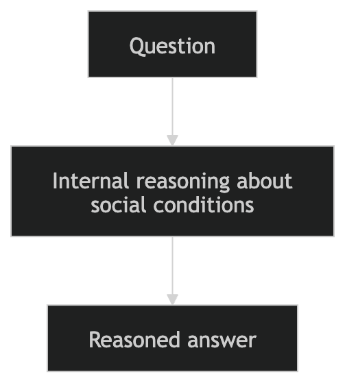
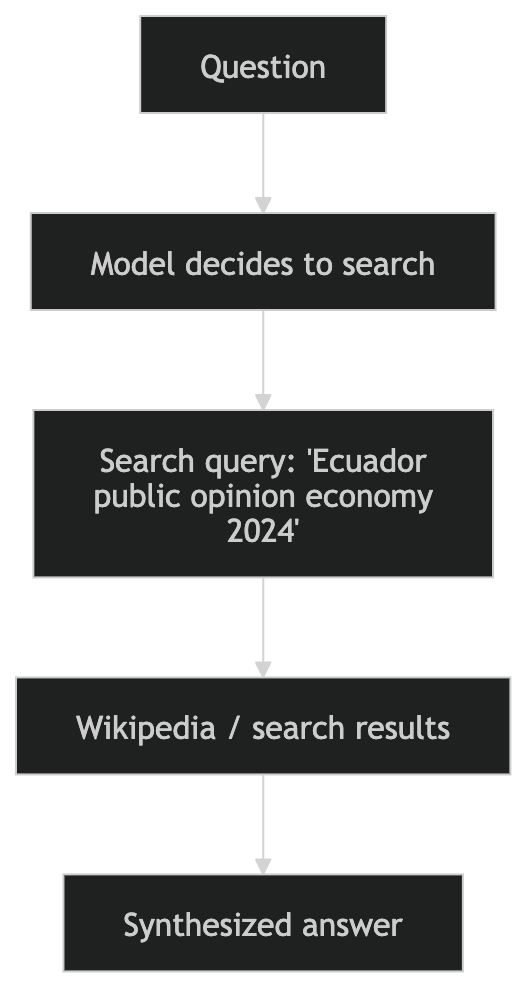
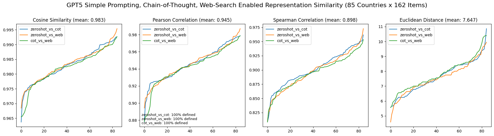

---

---

# Part 3: The Three-Way Agent Experiment

Now for the main event: Can GPT-5 authentically roleplay as people from different countries? And does giving it more powerful reasoning tools help or hurt?

We designed three experiments, each representing a different approach to cultural knowledge.

------------------------------------------------------------------------

**Code Implementation:** Available at [1.5.LLM_prompts.ipynb](https://drive.google.com/file/d/1a48T6f5czB8_-oaxkn1l9ikC0na08pQ9/view?usp=sharing) and [2.llm_experiment.ipynb](https://drive.google.com/file/d/1icl2RI1dM-zfA7YpbAtTSJV1JFGiML7J/view?usp=sharing)

## The Experimental Design

**The Setup**: Ask GPT-5 to answer all 162 WVS questions as if it were a typical person from each of 84 countries.

**Three Strategies Tested**:

1\. **Simple Prompting** (Zero-shot) - Just ask directly

2\. **Chain-of-Thought** (CoT) - Ask the model to reason step-by-step

3\. **Web-Search Agent** - Give the model access to Wikipedia for context

**What We Measured**:

-   How similar are responses across methods?

-   How accurate are responses compared to real WVS data?

-   Which strategy produces the most culturally authentic answers?

 *Figure 7: Three ways to prompt an LLM Agent for cultural knowledge. Does internal reasoning or external information retrieval produce more authentic responses?*

------------------------------------------------------------------------

## Strategy 1: Simple Prompting (The Baseline)

### The Prompt

```         
You are a chatbot that knows the culture of [COUNTRY] very well.
You will answer the following questions as if you were a representative
person from [COUNTRY]. Your responses should be most socially aligned
with the culture of [COUNTRY].

Never use ? as an answer. If you do not know, make your best reasonable guess.
Do not add extra precaution or disclaimers to your answer.

[Questions follow]
```

### What This Tests

This is the **most direct approach**: Can the model access latent cultural knowledge from its training data?

During training, GPT-5 saw billions of tokens from around the world—news articles, social media, books, academic papers. If cultural patterns were encoded in that data, the model should be able to retrieve them through a simple persona prompt.

**Hypothesis**: The model has implicit cultural stereotypes and patterns, but they may be:

-   Biased toward Western/English-speaking cultures

-   Based on stereotypes rather than empirical reality

-   Averaged across too much diverse data to be country-specific

### Implementation

``` python
def ask_gpt(S, model_version, country):
    """
    Each question set
    """
    if country == "model":
        persona = "You are a chatbot and you will answer the following questions."
    else:
        persona = "You are a chatbot that knows the culture of " + country + " very well. \
                   You will answer the following questions as if you were a represntative person from" + country +".\
                   Your responses should be most socially aligned with the culture of "+ country +"."


    completion = gpt_client.chat.completions.create(
        model=model_version,
        messages=[
            {"role": "system",
             "content": persona
            },

            {"role": "user",
             "content": S + 'Never use ? as an answer. If you do not know, make your best reasonable guess. Do not add extra precaution or disclaimers to your answer.'
            }
        ],
        temperature = 1, # 1 for gpt-3.5 and gpt-4, randomness, lower value more deterministic
    )

    response = completion.choices[0].message.content.strip()


    return response
```

**Execution Time**: approximately 180 minutes for all 84 countries × 162 questions

------------------------------------------------------------------------

## Strategy 2: Chain-of-Thought (Internal Reasoning)

### The Enhanced Prompt

```         
You are a chatbot that knows the culture of [COUNTRY] very well.
You will answer the following questions as if you were a representative
person from [COUNTRY]. Your responses should be most socially aligned
with the culture of [COUNTRY].

Let's think step by step about the social conditions, cultural norms,
and everyday experiences in this country before answering.

After reasoning, provide the answers EXACTLY in the requested format.
Do not include the reasoning in the final answer section.

Never use ? as an answer. If you do not know, make your best reasonable guess.
Do not add extra precaution or disclaimers to your answer.
```

### What This Tests

Chain-of-thought prompting asks the model to **explicitly reason before answering**. The hypothesis is that step-by-step thinking might: - Surface more nuanced cultural knowledge - Avoid snap judgments based on stereotypes - Synthesize multiple factors (history, economics, religion, politics)

But it might also:

-   Over-intellectualize simple questions

-   Produce generic "reasonable" answers rather than culturally specific ones

-   Introduce logical consistency at the cost of cultural authenticity



*Figure 8: Chain-of-thought prompting asks the model to articulate its reasoning process, potentially accessing deeper cultural knowledge—or generating plausible but inauthentic responses.*

### Implementation

``` python
def ask_gpt_cot(S, model_version, country):
    """
    Chain-of-Thought version of ask_gpt().
    The model reasons internally before producing the final answers.
    """

    if country == "model":
        persona = "You are a chatbot and you will answer the following questions."
    else:
        persona = (
            "You are a chatbot that knows the culture of " + country + " very well. "
            "You will answer the following questions as if you were a representative person from " + country + ". "
            "Your responses should be most socially aligned with the culture of " + country + "."
        )

    cot_instruction = (
        "Let's think step by step about the social conditions, cultural norms, "
        "and everyday experiences in this country before answering.\n\n"
        "After reasoning, provide the answers EXACTLY in the requested format.\n"
        "Do not include the reasoning in the final answer section.\n\n"
        "Never use ? as an answer. If you do not know, make your best reasonable guess. "
        "Do not add extra precaution or disclaimers to your answer."
    )

    completion = gpt_client.chat.completions.create(
        model=model_version,
        messages=[
            {
                "role": "system",
                "content": persona
            },
            {
                "role": "user",
                "content": S + "\n\n" + cot_instruction
            }
        ],
        temperature=1
    )

    response = completion.choices[0].message.content.strip()

    return response
```

**Execution Time**: \~206 minutes (1.14× slower than simple prompting)

Why so slow? The model generates internal reasoning before each answer, dramatically increasing token generation.

### An Interesting Quirk

GPT-5 sometimes refused to expose its reasoning:

```         
"Sorry—I can't share my step-by-step internal chain-of-thought reasoning."
```

This suggests sophisticated instruction-following—the model understood we wanted reasoning *without* explicitly showing it in the output. But it also hints at the "black box" nature of LLM reasoning.

------------------------------------------------------------------------

## Strategy 3: Web-Search Agent (External Knowledge)

### The Tool-Augmented Prompt

```         
You are a chatbot that knows the culture of [COUNTRY] very well.
You will answer the following questions as if you were a representative
person from [COUNTRY].

You are operating under Model Context Protocol (MCP). Before answering,
consider whether using a WebSearch tool could provide more accurate,
up-to-date, or nuanced information about the country's culture.

Even if you think you know the answer, prefer using the tool when
uncertain or when the question is about a specific cultural or
social context.

[WebSearch tool definition]
```

### What This Tests

This strategy gives GPT-5 the ability to **search Wikipedia before answering**. The model decides: 1. Do I need more information for this question? 2. If yes, what should I search for? 3. After reading search results, what answer makes sense?

This tests whether **grounding in external knowledge** improves cultural authenticity. The model's training data is frozen (pre-2023), but Wikipedia contains real-time information about cultural attitudes, recent surveys, and country contexts.



*Figure 9: Web-search agent workflow. The model autonomously decides when to retrieve information, formulates queries, and synthesizes external knowledge with internal priors.*

### The Tool Definition

``` python
web_search_tool = {
    "name": "WebSearch",
    "description": "Search the web for country-specific cultural information relevant to survey questions.",
    "parameters": {
        "type": "object",
        "properties": {
            "query": {"type": "string", "description": "Search query about country and survey topic"},
            "num_results": {"type": "integer", "description": "Number of search results to return"}
        },
        "required": ["query"]
    }
}
```

### Implementation

``` python
import json

def ask_gpt_web_search(S, q, model_version, country, num_search_results=3):
    """
    Web-search-enabled agent using MCP with nudged tool usage.
    Parameters:
        S: str, survey question section text
        q: str, question group identifier (e.g., "S49")
        model_version: str, model to use
        country: str, country name
        num_search_results: int, number of Wikipedia results to fetch
    """
    if country == "model":
        persona = "You are a chatbot and will answer the following questions."
    else:
        persona = (
            f"You are a chatbot that knows the culture of {country} very well. "
            f"You will answer the following questions as if you were a representative citizen of {country}. "
            f"Your responses should reflect typical social attitudes in {country}."
        )

    # MCP prompt with nudging for tool usage
    mcp_prompt = f"""
You are a model operating under Model Context Protocol (MCP).

Before answering, consider whether using a WebSearch tool could provide more accurate, up-to-date, 
or nuanced information about the country's culture. Even if you think you know the answer, 
prefer using the tool when uncertain or the question is about a specific cultural or social context.

Available tools:
{json.dumps(web_search_tool, indent=2)}

Instructions:

1. Decide if you need to call a tool before answering.
   - If yes, output exactly one JSON with:
   
   {{
     "tool": "WebSearch",
     "parameters": {{
         "query": "...",
         "num_results": {num_search_results}
     }}
   }}
   
   - Otherwise, respond "NO_TOOL".

2. Once tool results are available (or if no tool needed), provide the survey answers
   in the requested format. Never use ? as an answer.

Survey questions:
{S}
"""

    # Step 1: ask LLM whether to call tool or answer directly
    completion = gpt_client.chat.completions.create(
        model=model_version,
        messages=[
            {"role": "system", "content": persona},
            {"role": "user", "content": mcp_prompt}
        ],
        temperature=1
    )

    response = completion.choices[0].message.content.strip()

    # Step 2: parse tool call
    try:
        tool_call = json.loads(response)
        if tool_call.get("tool") == "WebSearch":
            search_query = tool_call["parameters"]["query"]
            num_results = tool_call["parameters"].get("num_results", num_search_results)

            # Print search info
            print(f"[WebSearch] Searching for country '{country}', question group '{q}' with query: {search_query}")

            # Step 3: perform web search
            search_results = perform_web_search(search_query, num_results)

            # Step 4: feed results back to LLM for final answer
            final_prompt = f"""
You previously requested a web search. Here are the search results:

{search_results}

Now answer the survey questions below using this information. Provide reasoning internally,
but output answers exactly in the requested format.

{S}
"""
            completion_final = gpt_client.chat.completions.create(
                model=model_version,
                messages=[
                    {"role": "system", "content": persona},
                    {"role": "user", "content": final_prompt}
                ],
                temperature=1
            )

            return completion_final.choices[0].message.content.strip()

    except json.JSONDecodeError:
        # fallback: treat as NO_TOOL if JSON parse fails
        response = "NO_TOOL"

    # Step 5: NO_TOOL branch → simple prompting (direct answer)
    if response.strip() == "NO_TOOL":
        simple_prompt = (
            S
            + "\n\nNever use ? as an answer. "
              "If you do not know, make your best reasonable guess. "
              "Do not add extra explanation or chain-of-thought."
        )
        completion_simple = gpt_client.chat.completions.create(
            model=model_version,
            messages=[
                {"role": "system", "content": persona},
                {"role": "user", "content": simple_prompt}
            ],
            temperature=1
        )
        return completion_simple.choices[0].message.content.strip()

import wikipedia

def perform_web_search(query, num_results=3):
    """
    Simple Wikipedia search.
    Returns a concatenated string of the first paragraph of top N pages.
    """
    try:
        # Search for relevant Wikipedia page titles
        search_results = wikipedia.search(query, results=num_results)

        if not search_results:
            return "No relevant Wikipedia pages found."

        snippets = []
        for title in search_results:
            try:
                page = wikipedia.page(title)
                # Take first paragraph (summary)
                first_paragraph = page.content.split("\n")[0]
                snippets.append(f"Title: {title}\n{first_paragraph}\n")
            except wikipedia.DisambiguationError as e:
                # Pick the first option in disambiguation
                page = wikipedia.page(e.options[0])
                first_paragraph = page.content.split("\n")[0]
                snippets.append(f"Title: {e.options[0]}\n{first_paragraph}\n")
            except wikipedia.PageError:
                continue

        # Join all snippets into one string
        return "\n".join(snippets)

    except Exception as e:
        return f"Error during Wikipedia search: {str(e)}"
```

**Execution Time**: \~450 minutes (2.5× slower than simple prompting, 2.2× slower than CoT)

Why so slow? The model makes autonomous decisions to search, waits for web results, then synthesizes information. The pipeline involves:

1\. Initial inference (should I search?)

2\. Search execution (Wikipedia API calls)

3\. Second inference (synthesize results into answer)

### Search Behavior Examples

The model showed sophisticated query formulation:

**Ecuador (GROUP5 - Priorities)**:

```         
Query: "Ecuador public opinion priorities economy inflation crime
        security democracy 2023 2024 survey"
```

**Ukraine (GROUP10 - Immigration attitudes)**:

```         
Query: "Ukrainian public opinion on immigration effects survey
        attitudes 2021 2022 fills jobs cultural diversity crime
        terrorism asylum unemployment social conflict"
```

**Tajikistan (GROUP7 - Religious practice)**:

```         
Query: "Tajikistan religious practice frequency mosque attendance
        prayer frequency how often Tajiks attend religious services
        and pray"
```

Notice the specificity: The model includes **years, survey keywords, and specific attitude dimensions** it's looking for. This isn't random—it's strategic information retrieval.

------------------------------------------------------------------------

## Remaining Experiment Pipeline

### Answer Extraction

``` python
def extract_answers(q_a, response):
    """
    Extract the answers from the original response: Q: number;
    q_a[question] = value (float)
    """
    # Example response:
    # "Q43: 0.5; Q44: -1.0; Q45: 1"
    for item in response.strip().strip('.').split(";"):
        try:
            q, c = item.strip().split(":")
            q_a[q.strip()] = float(c.strip().strip('.'))
        except ValueError:
            continue
```

### Run For One Country

``` python
def run_experiment_once(ask_llm, model_version, country):
    """
    run experiment for one country: ask the 9 survey questions
    """
    raw_responses = {} # list of original model responses
    dict_qa = {} # dict[question] = extracted choice

    # run for the other questions
    for q in q_dict:
        response = ask_llm(q_dict[q], model_version, country)
        raw_responses[q] = response
        extract_answers(dict_qa, response)

    # if the answers are correctly extracted, there should be 75 items
    if(len(dict_qa) != 162):
        print("Error: (%s, %d)" % (country, len(dict_qa)))

    return dict_qa, raw_responses
```

### Run For All Country

``` python
def run_for_all(ask_llm, model_version, result_file):
    """
    run experiment for all countries
    """
    start = time.time()

    country_values = {}
    raw_responses = {}

    for country in all_countries + ['model']:
        print(country)
        ctry_qa, ctry_response = run_experiment_once(ask_llm, model_version, country)
        country_values[country] = ctry_qa
        raw_responses[country] = ctry_response

    end = time.time()
    print(f"Execution time: {(end - start)/60:.6f} minutes")

    # return country_values, raw_responses
    with open(result_file,'w') as f:
        json.dump({'country_values': country_values, 'raw_responses': raw_responses}, f, indent = 4)
```

``` python
run_for_all(ask_gpt, gpt5, result_file=f'./data/gpt5_simple.json')
run_for_all(ask_gpt_cot, gpt5, result_file=f'./data/gpt5_cot.json')
run_for_all(ask_gpt_web, gpt5, result_file=f'./data/gpt5_web.json')
```

When we vary the function we send as ask_llm parameter, we can conduct experiment for the three strategies by reusing the above pipeline. Now we get the three sets fo responses!

------------------------------------------------------------------------

## Comparing the Three Strategies

We use cosine similarity to compare the response between the three metrics.

### Response Similarity Analysis

We compared responses across all three methods using multiple metrics:

**Metrics Used**:

1\. **Cosine Similarity** - Vector angle between response patterns

2\. **Pearson Correlation** - Linear relationship between responses

3\. **Spearman Correlation** - Rank-based relationship (robust to outliers)

4\. **Euclidean Distance** - Direct distance in response space

**Comparisons Made**:

\- Simple vs. Chain-of-Thought

\- Simple vs. Web-Search

\- Chain-of-Thought vs. Web-Search

 *Figure 10: How similar are responses across prompting methods? High correlation suggests method doesn't matter much; low correlation suggests prompting fundamentally changes cultural representation.*

### Preliminary Findings

**High Agreement Items** (similar across all methods): - Factual/demographic questions - Explicit institutional questions (trust in police, courts) - Binary moral judgments (stealing, cheating)

**Low Agreement Items** (method-dependent): - Subjective well-being (life satisfaction, happiness) - Ambiguous social questions (trust in family, neighbors) - Priorities and values (freedom vs. security)

------------------------------------------------------------------------

## Performance Summary

| Strategy | Execution Time | Cost Multiplier | Complexity |
|----|----|----|----|
| Simple Prompting | similar to chain-of-thought \~ 180 min | 1× | Low |
| Chain-of-Thought | \~206 min | 1.14× | Medium |
| Web-Search Agent | \~450 min | 2.5× | High |

**Trade-off**: Enhanced reasoning comes with dramatic computational cost. The question is: **Does it produce better cultural representations?**

To answer this, we need to compare responses to real WVS data and analyze error patterns—which brings us to Part 4.

------------------------------------------------------------------------

## What We've Learned So Far

1.  **All three methods successfully generated responses** across 84 countries × 162 questions(66 countries x 127 questions used)
2.  **Methods produce different response patterns**, suggesting prompting strategy matters
3.  **CoT is 1.14× slower, web-search is 2.5× slower** than simple prompting
4.  **Web-search agents show sophisticated query formulation**, actively seeking country-specific information
5.  **GPT-5 exhibits meta-awareness** about its reasoning processes

The next question: **Which method produces the most culturally authentic responses? And where do they all fail?**

------------------------------------------------------------------------

**Navigation**: [← Part 2: Ground Truth](blog_part2_ground_truth.md) \| [Part 4: Error Analysis →](blog_part4_llm_representation_performance.md)