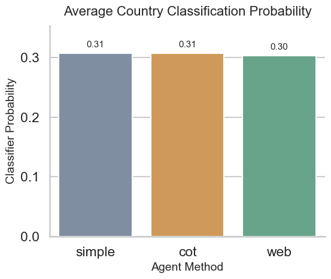
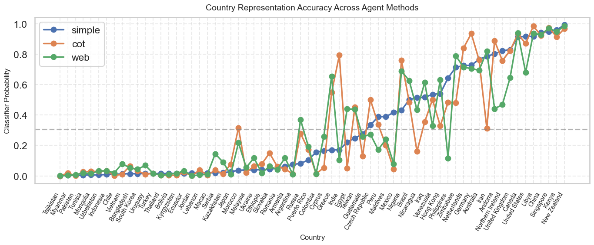
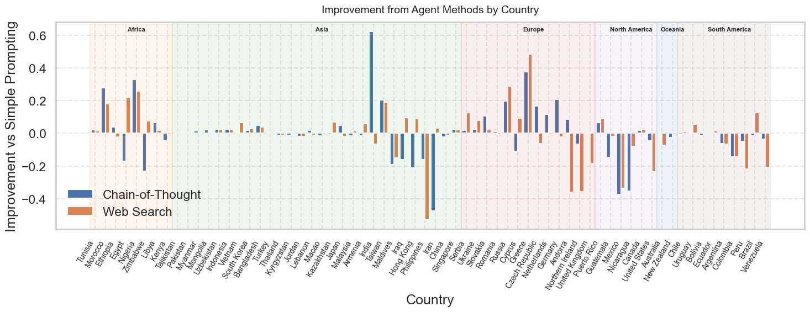
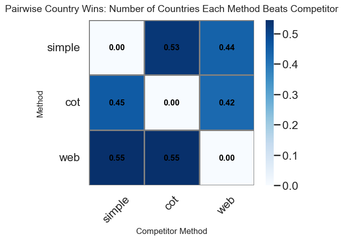
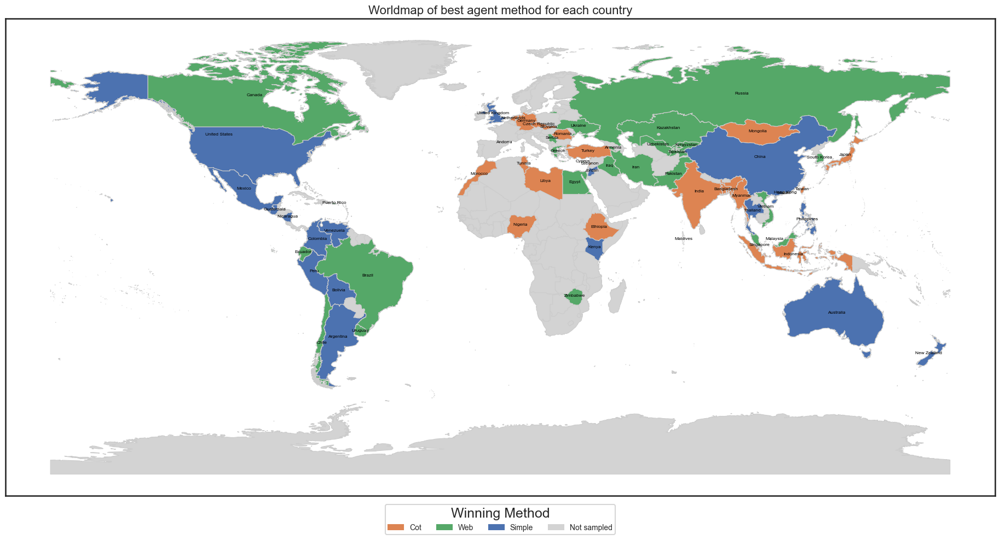
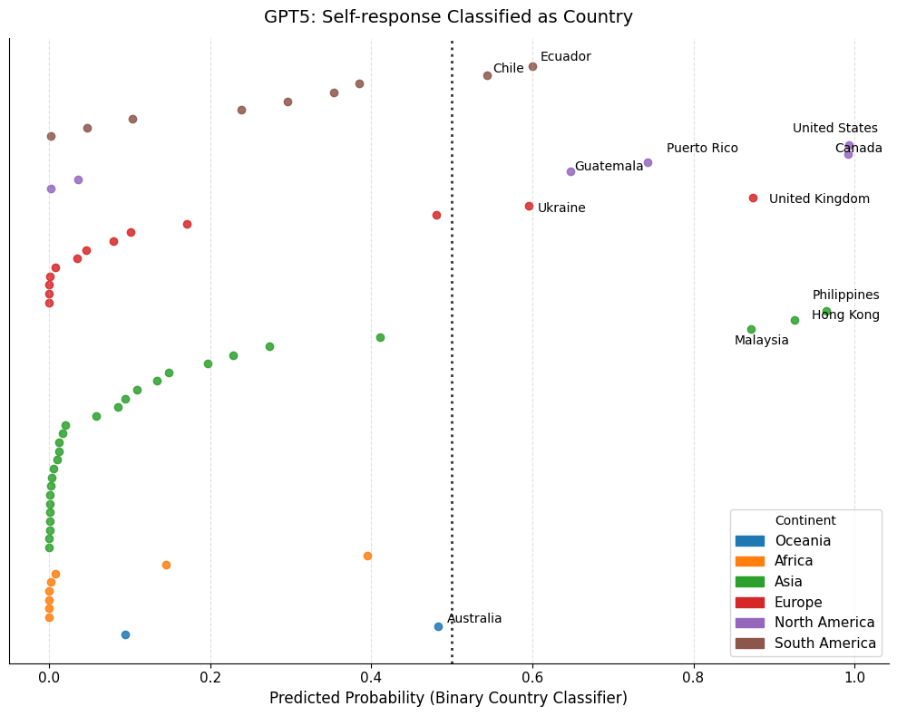
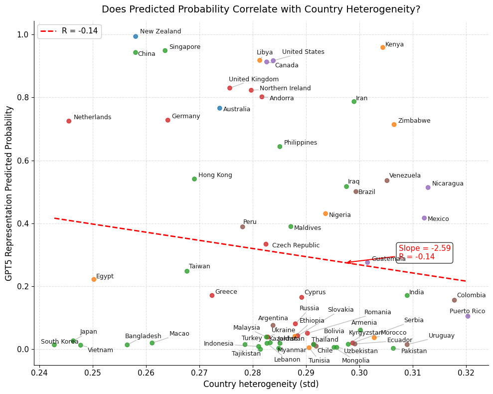
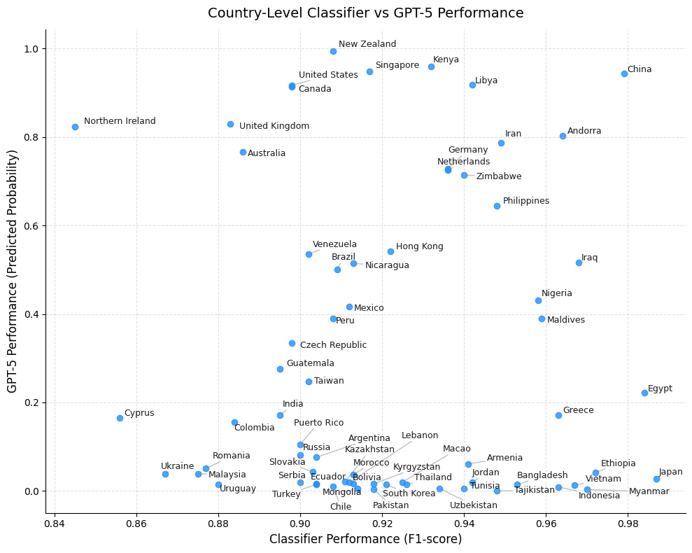
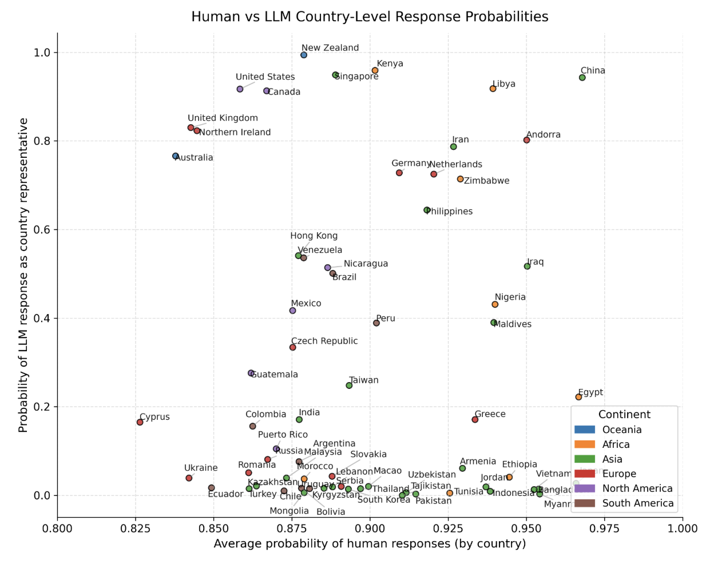

# Part 4: How Well Do LLMs Represent Cultures?

Now comes the moment of truth. We've trained 66 classifiers that can identify countries from their cultural value patterns with 92% accuracy. We've asked GPT-5 to roleplay as typical citizens from each country using three different prompting strategies.

The question: **Do the AI's responses pass the cultural fingerprint test?**

This section brings together everything from [Part 2: Ground Truth](blog_part2_ground_truth.md) and [Part 3: The Agent Experiment](blog_part3_llm_experiment.md) to evaluate how authentically LLMs represent different cultures.

------------------------------------------------------------------------

**Code Implementation:** Available at [1.ml_byctry.ipynb](https://drive.google.com/file/d/1TxhajfUe8jGl9GCqE_IUNb2AmfBUSGz4/view?usp=sharing)

## The Evaluation Pipeline

### Step 1: Preparing LLM Responses for Classification

We collected responses from GPT-5 across three prompting methods (simple, chain-of-thought, web-search) for 66 countries and 127 survey questions. Now we need to feed these responses through the same pipeline we used for real human data:

**Data Alignment**: Match the 127 questions used in classifier training with the responses from all three LLM experiments.

**Normalization**: Apply the same MinMax scaling transformations we used on the WVS data. This is crucial—the classifiers were trained on scaled features in the \[0, 1\] range, so LLM responses must be transformed identically.

**Feature Matrix Construction**: For each prompting method, create a 66×127 matrix where rows are countries and columns are normalized value features.

Here's how we transform the raw LLM responses into classifier-ready features:

``` python
def create_llm_feat_matrix(scaler, llm_values, wv7_countries):
    """
    Apply the same scaling transformations used in training to LLM responses.
    Each feature gets its own scaler to preserve the original scale ranges.
    """
    llm_feat_matrix = {}

    for llm, df in llm_values.items():
        df_llm = df.loc[wv7_countries, features].copy()
        df_scaled = pd.DataFrame(index=df_llm.index, columns=df_llm.columns)

        # Apply column-wise scaling using stored scalers from training
        for col in df_llm.columns:
            sc = scaler[col]  # Retrieve the specific scaler for this feature
            df_scaled[col] = sc.transform(df_llm[[col]]).ravel()

        llm_feat_matrix[llm] = df_scaled

    return llm_feat_matrix

# Create scaled feature matrices for all three prompting methods
llm_feat_matrix = create_llm_feat_matrix(item_scaler, llm_values, wv7_countries)
```

Why this matters: If we don't apply identical scaling, the classifiers will see feature values outside their training distribution, leading to nonsensical predictions.

------------------------------------------------------------------------

### Step 2: Running the Cultural Fingerprint Test

Now we apply our 66 country-specific classifiers to evaluate each LLM's representation. For each country, we ask: **"Does this classifier recognize the LLM's responses as culturally authentic for this country?"**

The classifiers output probability scores between 0 and 1, where:

\- **1.0** = Perfect match with the country's real cultural pattern

\- **0.5** = Ambiguous (equally likely to be from this country or not)

\- **0.0** = Complete mismatch

``` python
def classify_llm_values(llm_feat_matrix, ctry_clf, wv7_countries):
    """
    Test each LLM's country representations against trained classifiers.
    Returns probability that each representation matches its target country.
    """
    llm_probs = {}

    for llm in llm_feat_matrix:
        df_feat = llm_feat_matrix[llm]
        probs = []

        for ctry in wv7_countries:
            # Get probability that this representation belongs to the target country
            prob = ctry_clf[ctry].predict_proba([df_feat.loc[ctry]])[0]
            country_prob = dict(zip(ctry_clf[ctry].classes_, prob))[ctry]
            probs.append(country_prob)

        llm_probs[llm] = probs

    return pd.DataFrame(llm_probs, index=wv7_countries)

# Run the cultural fingerprint test
df_llm_prob = classify_llm_values(llm_feat_matrix, ctry_clf, wv7_countries)
```

This gives us a 66×3 matrix where each cell shows how well a specific prompting method captured a specific country's cultural signature.

## The Results: Which Strategy Wins?

### Overall Performance—A Surprising Finding

When we average the classification probabilities across all 66 countries, a striking pattern emerges: **all three methods perform similarly poorly**, with mean probabilities hovering around 0.3.



*Figure 11: Average cultural authenticity scores across all 66 countries. All three prompting methods achieve similar mean performance (\~0.3), well below the 0.5 random baseline and far from the 0.92 accuracy of real human data.*

This is shocking. Remember, our classifiers achieved 92% accuracy on real human data. If GPT-5's representations were culturally authentic, we'd expect probabilities clustering near 1.0. Instead, they cluster near 0.3—**below the 0.5 random chance threshold**.

What this tells us: **GPT-5 struggles to authentically represent country-specific cultural values, regardless of prompting strategy.** The model produces responses that are systematically biased away from real cultural patterns.

------------------------------------------------------------------------

### Performance Varies Dramatically by Country

While average performance is dismal, the country-level picture reveals more nuance. Some countries are represented well (probabilities near 1.0), while others are completely misrepresented (probabilities near 0.0).



*Figure 12: Cultural authenticity by country and method. Countries are sorted by simple prompting performance. Note the wild swings for CoT (orange) and web-search (green) in the middle range, while methods converge at the extremes.*

**Key observations:**

**Countries with consistently high scores** (probability \> 0.7): The three methods agree here. All strategies successfully capture these cultural signatures. Examples include Japan, Ethiopia, and China—countries with highly distinctive value patterns.

**Countries with consistently low scores** (probability \< 0.2): Again, methods converge. All strategies fail equally for these countries. The classifier consistently rejects the LLM's representations as culturally inauthentic.

**Countries in the middle** (probability 0.2-0.7): This is where methods diverge dramatically. Chain-of-thought might score 0.8 while simple prompting scores 0.2 for the same country. This suggests different strategies activate different latent representations in the model.

------------------------------------------------------------------------

### Where Do Enhanced Methods Help?

To understand when chain-of-thought or web-search improves representation, we calculated the performance gain/loss relative to simple prompting for each country.



*Figure 13: Performance gain/loss by continent. Positive bars indicate enhanced methods outperformed simple prompting; negative bars indicate degradation. Patterns cluster by geography.*

**Regional patterns emerged:**

**Europe and Africa**: Enhanced methods (especially web-search) often **improve** performance when they differ significantly from simple prompting. For European countries, web-search gains access to recent survey data from Eurobarometer and other sources, grounding representations in factual information.

**Americas and Oceania**: Enhanced methods frequently **degrade** performance. In many Latin American countries, chain-of-thought reasoning introduces generic "developing country" stereotypes that override culturally specific priors. Web-search retrieves information that may be less relevant or more dated for these regions.

**Asia**: Mixed results with limited dramatic differences. Asian countries tend to be either extremely well-represented (Japan, China) or extremely poorly represented (Myanmar, Yemen) across all methods, leaving little room for improvement.

**Key insight**: Surprisingly, neither chain-of-thought reasoning nor web retrieval consistently improved cultural authenticity. In many cases, simple prompting produced representations closer to real survey distributions. This suggests that **large language models may already encode latent cultural priors that additional reasoning or retrieval can inadvertently distort** rather than refine.

### Head-to-Head: Which Method Wins Most Countries?

To understand relative performance, we conducted pairwise comparisons: for each country, which method achieved the highest probability score?



*Figure 14: Pairwise win counts across 66 countries. Numbers show how many countries each method wins against each competitor.*

**Simple vs. Chain-of-Thought:** Simple prompting wins in **35 countries**, while CoT wins in **30**. The battle is nearly even. This reveals that expensive chain-of-thought reasoning doesn’t reliably improve cultural representation—in fact, it slightly underperforms the baseline.

**Simple vs. Web-Search:** Web-search wins in **36 countries**, while simple prompting wins in **29**. Web-search has a slight edge, suggesting that grounding in external information helps in more cases than it hurts.

**Chain-of-Thought vs. Web-Search:** Web-search wins in **36 countries**, while CoT wins in only **28**. This is the most decisive comparison—web-search consistently outperforms CoT.

**The overall ranking:**

1.  **Web-search** (strongest): Most wins across pairwise comparisons
2.  **Simple prompting** (competitive): Slightly ahead of CoT, despite being the simplest method
3.  **Chain-of-thought** (weakest): Least reliable, sometimes improving but often degrading performance

**What this means:** External knowledge retrieval (web-search) is more valuable than internal reasoning (CoT) for cultural representation. But the fact that simple prompting remains competitive suggests that **the model’s latent cultural knowledge is already surprisingly rich**—adding reasoning layers can distort rather than refine it.

### Geographic Patterns: Which Method Works Where?

When mapping the winning prompting method for each country, clear regional patterns emerge.



*Figure 15: Geographic distribution of winning methods. Colors indicate which prompting strategy achieved the highest cultural authenticity score for each country.*

**Web-search prompting (green)** dominates in **Eastern Europe, the Middle East, Canada, and parts of South America**. In these regions, Wikipedia and other easily retrievable sources often contain **recent survey data and detailed cultural information**, enabling the model to ground its answers in externally retrieved evidence.

**Simple prompting (blue)** performs best across **the United States, Mexico, Western Europe, Oceania, and the Chinese cultural sphere in East Asia**, as well as parts of South America. In these regions, the model’s **latent cultural priors learned during training** appear sufficient to produce strong predictions, and additional reasoning or retrieval does not consistently improve performance.

**Chain-of-thought prompting (orange)** wins in **much of Africa, parts of Central Europe, and several Asian countries including India, Mongolia, Japan, and parts of Southeast Asia**. In these regions, neither the model’s internal priors nor easily retrievable external information consistently provides strong signals about cultural attitudes. **Structured reasoning therefore appears to help the model piece together partial knowledge**, infer plausible relationships between cultural variables, and generate more accurate predictions. Unlike web-search prompting, however, these gains do not rely on external data availability but rather on the model’s ability to reason through uncertain information.

#### Interpretation

Overall, these geographic patterns suggest that the effectiveness of prompting strategies depends on the interaction between external knowledge availability and the strength of the model’s internal cultural priors. Retrieval works best where high-quality external information exists, simple prompting excels where the model already has strong internal knowledge, and chain-of-thought reasoning provides benefits when both sources of information are relatively weak or incomplete.

------------------------------------------------------------------------

### The Model’s “Default Culture”: What Country Does GPT-5 Resemble?

We ran an additional experiment: asking GPT-5 the same survey questions with a **neutral persona** (“You are a chatbot”) instead of country-specific personas. Then we used our classifiers to detect which country’s cultural pattern the “default” GPT-5 most resembles.



*Figure 16: When GPT-5 uses no country persona, which cultures does it resemble? Top matches reveal the model’s “default” cultural stance.*

Interestingly, the countries with highest probabilities for neutral GPT-5 are **not** the same as those that performed best with explicit country personas. The model’s default cultural stance reflects a blend of:

-   English-speaking Western democracies (US, UK, Canada)
-   Cosmopolitan international perspectives
-   Secular, individualistic values

This reveals a **cultural bias in the base model**: without explicit instructions to adopt a specific cultural perspective, GPT-5 defaults to a Western, English-centric worldview. This baseline bias explains why enhanced prompting methods can sometimes degrade performance—they may pull the model toward its Western default rather than toward the target culture.

------------------------------------------------------------------------

### What Predicts LLM Performance? Three Factors

To understand **why** some countries are represented well and others poorly, we examined three potential predictors using simple prompting data:

**1. Within-Country Heterogeneity**

Countries with more diverse internal populations (high standard deviation across respondents) should be harder to represent with a single “typical person” persona.



*Figure 17: Relationship between cultural heterogeneity and simple prompting LLM representation quality. Correlation is negative but weak (r ≈ -0.25).*

The relationship is **weakly negative**: as heterogeneity increases, performance decreases slightly. However, the slope is shallow. Many highly heterogeneous countries (like India or Nigeria) still achieve moderate probabilities, while some homogeneous countries (like Sweden) are poorly represented.

**Conclusion**: Heterogeneity explains some variance but is not the primary driver of LLM performance.

**2. Classifier Quality (F1-Score)**

Perhaps LLMs struggle with countries that are inherently hard to classify—those with less distinctive cultural fingerprints.



*Figure 18: Relationship between classifier quality and simple prompting LLM performance. Note the bimodal distribution: many countries cluster near zero probability despite high classifier F1-scores (0.85-1.0).*

This reveals a **bimodal pattern**:

-   **Cluster 1** (near 0.0 probability): Many countries with excellent classifiers (F1 \> 0.9) are still completely misrepresented by LLMs. The cultural pattern is distinctive and learnable, but GPT-5 fails to capture it.

-   **Cluster 2** (positive slope): Among countries the LLM represents at all (probability \> 0.3), there’s a strong positive relationship—better classifiers correlate with better LLM performance.

**Conclusion**: Classifier quality doesn’t predict whether the LLM will attempt authentic representation, but **among countries it does represent**, those with clearer cultural signatures perform better.

**3. Human Baseline Probability**

This measures how well the classifier performs on held-out real human data—essentially, how “classifiable” each country’s real population is.



*Figure 19: Relationship between human baseline performance and simple prompting LLM performance. Again, many countries with excellent human classification (\>0.9) are near-zero for LLMs.*

The pattern mirrors the F1-score findings: **bimodal distribution with many excellent-baseline countries completely missed by LLMs**, but a strong positive relationship among countries the LLM represents.

**Overall conclusion**: LLM performance is not simply a function of task difficulty. Many easily-classified, culturally-distinctive countries are systematically misrepresented. This suggests **systematic biases** in the model’s cultural knowledge rather than random noise or task difficulty.

------------------------------------------------------------------------

## Summary: Five Key Findings

### 1. **All Prompting Methods Struggle with Cultural Authenticity**

Average performance across all three strategies hovers around 0.3 probability—**below random chance** and far below the 0.92 baseline for real human data. GPT-5's cultural representations are systematically biased away from authentic patterns, regardless of prompting strategy.

### 2. **Web-Search Outperforms Chain-of-Thought**

When enhanced methods differ from simple prompting, web-search produces better results than chain-of-thought in 36 vs. 28 countries. **External knowledge retrieval is more valuable than internal reasoning** for cultural representation tasks.

### 3. **Simple Prompting Remains Competitive**

Despite being the simplest and fastest method, simple prompting achieves comparable overall performance to both enhanced strategies. This suggests **the model's latent cultural knowledge is already rich**—additional processing can distort rather than refine it.

### 4. **Performance Varies Dramatically by Region**

The best prompting strategy differs markedly across regions. Web-search prompting performs best where rich cultural information is available online, particularly in Central and Eastern Europe and parts of the Americas. Simple prompting dominates in regions strongly represented in the model’s training data, such as the United States, Western Europe, Oceania, and the Chinese cultural sphere. Chain-of-thought prompting performs best across much of Africa and several Asian countries, where both external data and internal priors may be weaker, making structured reasoning more helpful. Overall, the results show that **prompting effectiveness depends on the balance between external knowledge availability and the model’s built-in cultural knowledge.**

### 5. **Systematic Biases, Not Random Errors**

Many culturally distinctive, easily-classified countries (like Nigeria, Myanmar, or Venezuela) are completely misrepresented by LLMs (probability near 0). Meanwhile, some less distinctive countries (like Western European nations) are represented well. This reveals **systematic Western-centric biases** rather than random performance degradation.

------------------------------------------------------------------------

## The Deeper Question: Why Do LLMs Fail at Cultural Representation?

These findings raise a troubling question: **Why do models trained on global internet data struggle to represent non-Western cultures authentically?**

Several hypotheses emerge:

**Hypothesis 1: Training Data Imbalance** The model has seen far more English-language content from Western sources. Non-Western cultures appear primarily through Western journalistic or academic lenses, creating filtered, potentially stereotyped representations.

**Hypothesis 2: Persona Prompting Limitations** Asking an LLM to "roleplay as a typical person from Country X" may activate stereotypes rather than authentic cultural knowledge. The model might be accessing its representations of "what Westerners think about Country X" rather than "what Country X actually believes."

**Hypothesis 3: Value Aggregation Problem** Cultural values exist at the population level as distributions, not single points. A "typical person" is a statistical abstraction. LLMs may struggle to represent distributional properties, instead generating individual-level responses that don't match population averages.

**Hypothesis 4: Cultural Knowledge Fragmentation** The model's cultural knowledge may be fragmented across contexts—stored separately in political, economic, religious, and social domains. Simple prompting may access one fragment while enhanced reasoning accesses others, neither capturing the holistic cultural pattern.

To investigate these hypotheses further, we need to go deeper: **analyzing not just overall performance, but specific error patterns and how they change across prompting strategies.**

This brings us to Part 5, where we examine the **geography of AI errors**—which specific values get misrepresented, and how error patterns cluster across countries and cultures.

------------------------------------------------------------------------

## What This Means for AI Systems

The implications extend beyond this academic exercise:

**For AI Safety**: If LLMs systematically misrepresent non-Western cultures, using them for cultural consultation, policy advice, or cross-cultural communication could perpetuate harmful biases at scale.

**For AI Development**: Simply scaling up models or adding reasoning capabilities doesn't solve cultural representation. We need **targeted interventions**: better training data diversity, cultural-specific fine-tuning, or hybrid systems that combine LLMs with curated cultural databases.

**For AI Evaluation**: Standard benchmarks miss cultural authenticity. We need evaluation frameworks that test **distributional alignment** between AI outputs and real population-level data, not just fluency or factual accuracy.

The next sections explore these error patterns in detail, revealing not just where LLMs fail, but **why** and **how**—knowledge essential for building more culturally aware AI systems.

------------------------------------------------------------------------

**Navigation**: [← Part 3: Agent Experiment](blog_part3_llm_experiment.md) | [Part 5: Error Analysis →](blog_part5_llm_representation_error.md)