# Part 5: The Geography of AI Errors

In Part 4, we discovered that LLMs struggle to authentically represent most countries, with classification probabilities averaging only 0.3—well below chance. But this aggregate view obscures crucial patterns. **Which specific values does the model get wrong? And do these errors cluster by geography or culture?**

This section shifts from overall performance scores to granular error analysis. We examine not just whether the model is right or wrong, but **how it's wrong**—which values it overestimates, which it underestimates, and whether these error patterns reveal systematic biases.

------------------------------------------------------------------------

**Code Implementation:** Available at [3.analysis.ipynb](https://drive.google.com/file/d/1edzskLb5E6PE48rZQ5Yy62M2-nAF9x0a/view?usp=sharing)

## From Performance to Error Patterns

### The Error Matrix Approach

Instead of asking "How accurate is the model?", we now ask: **"What mistakes does the model make, and for which countries?"**

For each combination of country and survey question, we calculate:

**Error = LLM Response - Real WVS Average**

This produces three error matrices (one per prompting method), each containing:

-   **66 countries** (rows)

-   **127 survey questions** (columns)

-   **8,382 error values** per matrix

**Interpretation:**

-   **Positive errors** (e.g., +0.5): The model **overestimates**—predicts higher values than reality

-   **Negative errors** (e.g., -0.3): The model **underestimates**—predicts lower values than reality

-   **Near-zero errors** (e.g., ±0.05): The model is accurate

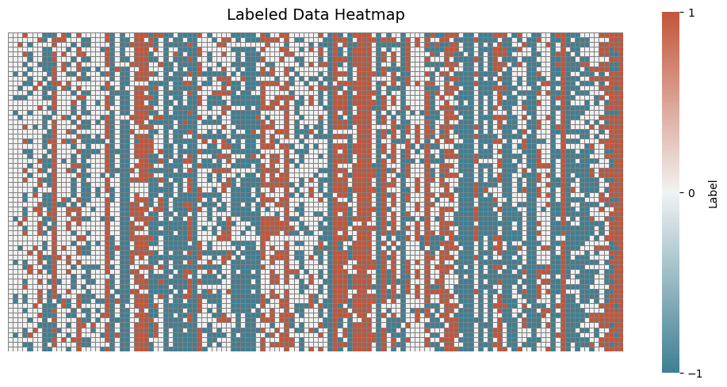

*Figure 20: Error matrix for simple prompting across all 66 countries and 127 questions. Red = overestimation, blue = underestimation, white = accurate. Notice how certain countries show similar color patterns, suggesting shared error profiles.*

### Computing the Error Matrices

The calculation is straightforward: for each country, we subtract the real WVS country average from the LLM's response for that country:

``` python
def calculate_difference(llm='simple'):
    """
    Compute error matrix: LLM responses - WVS averages
    Returns: DataFrame with countries as rows, 127 questions as columns
    """
    dif_byctry = {}
    for ctry in wv7_countries:
        wvs_vec = df[df['country'] == ctry][cd_127].mean().values  # Real data
        llm_vec = llm_feat_matrix[llm].loc[ctry].values  # LLM prediction
        dif_byctry[ctry] = llm_vec - wvs_vec  # Error = prediction - reality

    return pd.DataFrame(dif_byctry).T
```

We run this for all three prompting methods, producing three error matrices that capture how each strategy misrepresents cultural values across all countries and questions.

------------------------------------------------------------------------

## Coding Errors: What Counts as "Wrong"?

### The Threshold Question

Not all errors are created equal. An LLM predicting 3.05 when the truth is 3.00 is negligibly different from one predicting 3.50 when the truth is 3.00. We need a threshold to distinguish **meaningful errors** from **noise**.

We tested three approaches:

1\. **Statistical method**: Flag only the largest 5% of differences (too conservative—misses many real errors)

2\. **Threshold = 0.1**: Captures \~40% of all differences (too lenient—includes minor fluctuations)

3\. **Threshold = 0.2**: Captures \~25% of differences (**chosen**)

**Why 0.2?** On survey scales ranging from 1-4 or 1-10, a 0.2 difference represents a substantive shift.

For example:

\- Life satisfaction (1-10 scale):

0.2 = moving from "7.0 - Satisfied" to "7.2 - Still satisfied" vs. "6.8 - Less satisfied"

\- Binary moral questions (0-1 scale):

0.2 = meaningful shift in population opinion

This threshold balances precision (focusing on clear errors) with sensitivity (not missing important patterns).

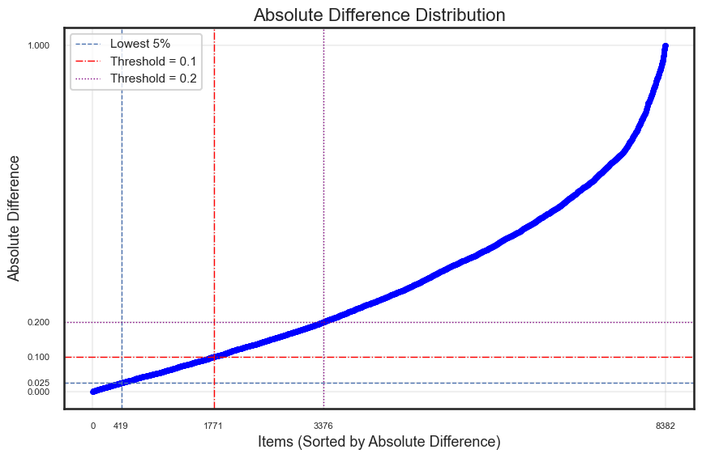

*Figure 21: Distribution of error magnitudes across all country-question pairs. The 0.2 threshold (red line) captures the top \~25% of differences, focusing analysis on substantive misalignments while filtering noise.*

------------------------------------------------------------------------

### Two Ways to Encode Errors

With our threshold set, we transform continuous error values into categorical codes that enable pattern recognition:

**Labeled Matrix** (Directional errors):

\- **+1**: Overestimation (LLM \> Reality + 0.2)

\- **0**: Accurate (\|Error\| ≤ 0.2)

\- **-1**: Underestimation (LLM \< Reality - 0.2)

**Binary Matrix** (Error presence):

\- **1**: Significant error (\|Error\| \> 0.2)

\- **0**: No significant error (\|Error\| ≤ 0.2)

``` python
def code_error_df(df_diff, threshold=0.2):
    """
    Transform continuous errors into categorical labels for pattern detection.

    Returns:
    - df_labeled: Directional errors (-1, 0, +1)
    - df_binary: Error presence (0, 1)
    """
    df_labeled = df_diff.copy()
    df_labeled[df_diff > threshold] = 1  # Overestimation
    df_labeled[df_diff < -threshold] = -1  # Underestimation
    df_labeled[(df_diff >= -threshold) & (df_diff <= threshold)] = 0  # Accurate

    df_binary = (df_diff.abs() > threshold).astype(int)  # Error yes/no

    return df_labeled, df_binary
```

The labeled matrix tells us **which direction** the model errs (does it think people are more or less religious? More or less trusting?). The binary matrix tells us simply **whether** the model errs significantly, regardless of direction.

Both are useful: labeled matrices capture nuanced bias patterns, while binary matrices enable robust similarity computation.

------------------------------------------------------------------------

## Measuring Error Pattern Similarity

### The Core Question

If two countries show similar error patterns—the model overestimates the same values, underestimates the same values—this suggests **the model encodes them similarly**. It's applying the same (mis)understanding to both.

To detect these shared error profiles, we need to measure **similarity** between country error patterns. But how?

### Four Similarity Metrics Tested

We explored four different mathematical approaches to quantify how similar two countries' error patterns are:

**1. Cosine Similarity** Measures the angle between two error vectors in 127-dimensional space. High cosine similarity means the countries show errors in the same direction across questions, even if the magnitudes differ.

**2. Simple Matching Coefficient (SMC)** Calculates the proportion of questions where both countries have the same error code (both +1, both 0, or both -1). Simple and intuitive.

**3. Jaccard Similarity** Focuses only on errors, ignoring questions where both countries are accurate. Useful when we care about shared mistakes rather than shared correctness.

**4. Cohen's Kappa** A chance-corrected agreement measure. Asks: "How much better than random is the agreement between these two error patterns?"

### Validation: Do All Metrics Agree?

If different metrics produced wildly different similarity rankings, we'd worry that findings are artifacts of metric choice. But remarkably, **all four metrics yield consistent community groupings**.

Countries that cluster together using cosine similarity also cluster together using Jaccard, Cohen's Kappa, and the other metrics. This cross-validation confirms our error patterns are **real and robust**, not methodological artifacts.

For the final analysis, we use **cosine similarity** because: - It captures directional bias (overestimation vs. underestimation) - It's computationally efficient for large matrices - It's interpretable (angle between error vectors) - It's widely used in NLP and cultural representation research

``` python
def compute_cosine_similarity(df_labeled):
    """
    Compute pairwise similarity between all 66 countries based on error patterns.

    Returns: 66×66 matrix where cell (i,j) = similarity between country i and j
    """
    from sklearn.metrics.pairwise import cosine_similarity

    cos_sim = cosine_similarity(df_labeled)  # Compute all pairwise similarities
    cos_sim_df = pd.DataFrame(cos_sim,
                              index=df_labeled.index,
                              columns=df_labeled.index)
    return cos_sim_df
```

This produces a 66×66 similarity matrix. High values (near 1.0) indicate countries with nearly identical error patterns. Low values (near 0 or negative) indicate countries the model treats very differently.

------------------------------------------------------------------------

## Discovering Cultural Error Clusters

### From Similarity to Communities

We now have 66×66 similarity matrices showing which countries share error patterns. The next question: **Can we detect clusters—groups of countries the model consistently misrepresents in similar ways?**

This would reveal the model's **latent cultural taxonomies**: how it mentally groups countries when reasoning about cultural values.

### K-Means: A Dead End

The standard approach is K-means clustering, which partitions countries into k groups by minimizing within-group variance. We tested multiple values of k and evaluated using silhouette scores and elbow plots.

**Result**: K-means **consistently suggested k=2**—just two clusters.

This is interpretable ("Western vs. non-Western") but overly simplistic. Cultural geography is more nuanced than a binary split. Moreover, K-means assumes: - Hard boundaries (every country belongs to exactly one cluster) - Spherical clusters (equal variance in all dimensions) - Fixed k (we must specify the number of clusters in advance)

These assumptions don't match cultural reality. Countries can be similar to one cultural region in some dimensions (e.g., economic values) but another region in other dimensions (e.g., religious values). **Culture is overlapping and hierarchical, not cleanly partitioned.**

### Louvain Community Detection: A Network Approach

We turned to a method from network science: **Louvain community detection**. This algorithm:

1.  **Treats countries as nodes** in a network
2.  **Treats similarity scores as weighted edges** (stronger similarity = thicker connection)
3.  **Automatically discovers** the optimal number of communities
4.  **Maximizes modularity**: Communities have high internal similarity and low external similarity
5.  **Allows flexible structure**: Communities can vary in size and don't require hard boundaries

The process:

-   Build a similarity network where countries are connected if their similarity exceeds a threshold

-   Apply the Louvain algorithm to partition this network into communities

-   Evaluate using modularity score (higher = clearer community structure)

### Choosing the Optimal Edge Threshold

Before running Louvain, we need to decide: **What similarity score is high enough to connect two countries with an edge?**

Too low a threshold → Every country connects to every other country → No meaningful communities Too high a threshold → Few connections → Fragmented singletons, no structure

We find the optimal threshold by **maximizing modularity**—the metric that Louvain aims to optimize.

**The search process:**

1\. Test a range of threshold values (from 10th to 90th percentile of all similarity scores)

2\. For each threshold, build the network and compute modularity

3\. Select the threshold that yields maximum modularity

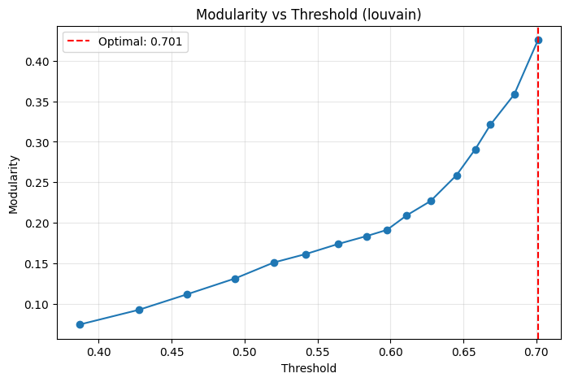

*Figure 22: Threshold optimization for simple prompting. Modularity peaks at \~0.55 similarity, indicating the optimal balance between network connectivity and community structure.*

This data-driven approach ensures we're not arbitrarily choosing thresholds—we let the community structure itself reveal the right level of connection.

------------------------------------------------------------------------

### The Complete Pipeline: From Errors to Communities

We've built all the components. Now we assemble them into an end-to-end pipeline that processes error matrices into geographic community maps:

``` python
def run_error_community_pipeline(df_diff, method_name, coding_threshold=0.2):
    """
    Complete pipeline: error matrix → community detection → visualization

    Steps:
    1. Code errors into categorical labels
    2. Compute pairwise similarity
    3. Find optimal network threshold
    4. Detect communities with Louvain
    5. Visualize as network and world map

    Returns: labeled matrix, binary matrix, similarity matrix,
             community assignments, modularity score, network graph
    """
    # Step 1: Convert continuous errors to labels
    df_labeled, df_binary = code_error_df(df_diff, threshold=coding_threshold)

    # Step 2: Compute country-country similarity
    cos_sim_df = compute_cosine_similarity(df_labeled)

    # Step 3: Optimize network threshold
    optimal_threshold = find_optimal_threshold(cos_sim_df, method='louvain')

    # Step 4: Detect communities
    partition_dict, modularity, G = detect_louvain_communities(
        cos_sim_df, method_name, threshold=optimal_threshold
    )

    # Step 5: Visualize geographically
    world_map_visualization(partition_dict, method=method_name)

    return df_labeled, df_binary, cos_sim_df, partition_dict, modularity, G
```

**What this produces:**

**Network Visualization**: Countries as nodes, colored by community, with edges showing similarity strength. This reveals the **structural relationships**—which countries are central hubs, which are peripheral, and how tight each community is.

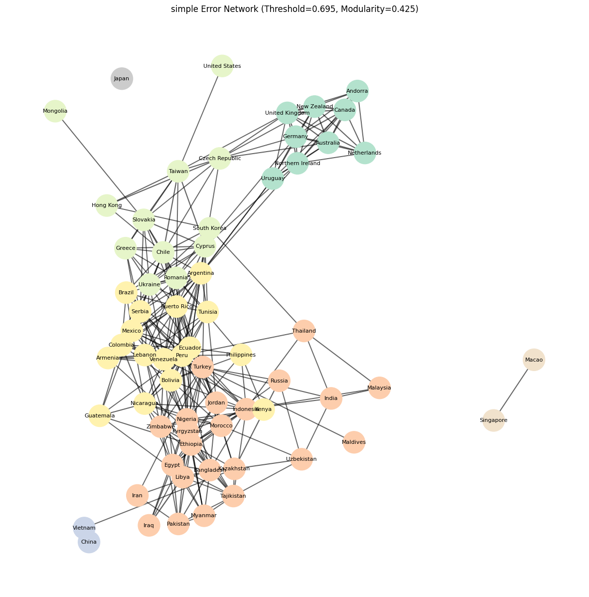

*Figure 23-1: Error similarity network for simple prompting. Node colors indicate community membership. Edge thickness represents similarity strength. Notice how Western democracies (green cluster, top right) are densely connected, while some communities (e.g., East Asia) form tight but small groups.*

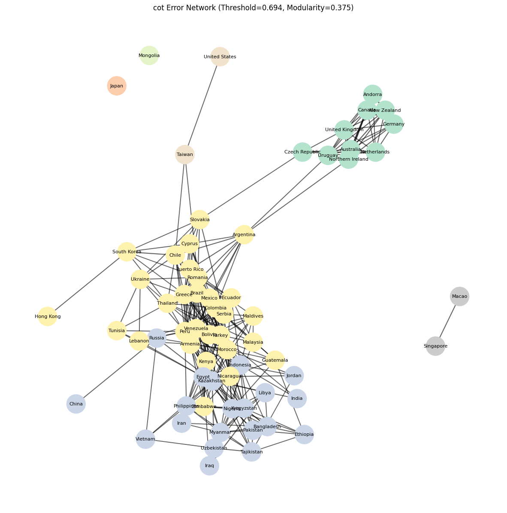

*Figure 23-2: Error similarity network for Chain-of-Thought. Node colors indicate community membership. Edge thickness represents similarity strength. Notice how Western democracies (green cluster, top right) are densely connected. Note how some nodes (China, Hong Kong, U.S.) are only connected to one other node.*

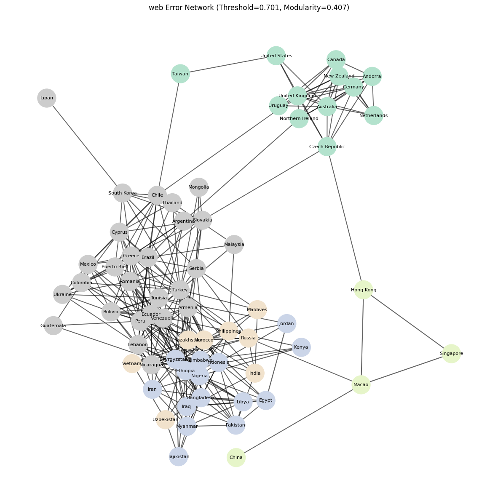

*Figure 23-3: Error similarity network for web-search enabled agent. Node colors indicate community membership. Edge thickness represents similarity strength. .Note the East Asian 'peninsula' formed on lower right-hand side.*

**World Map Visualization**: Countries colored by community assignment. This reveals the **geographic patterns**—do communities follow continental boundaries? Or do they cross them?

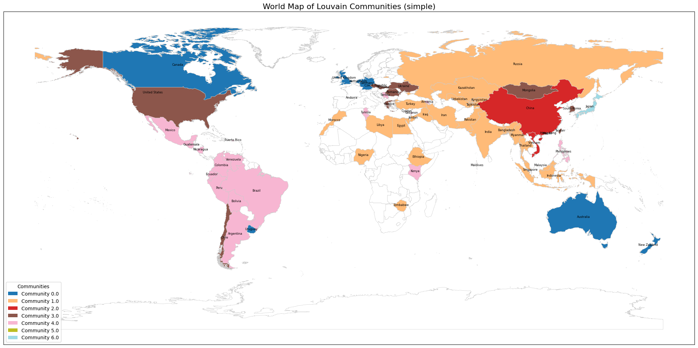

*Figure 24-1: Geographic distribution of error communities (simple prompting). Colors indicate shared error patterns. Notice how culturally similar countries (e.g., East Asia, Latin America) often but not always share communities.*

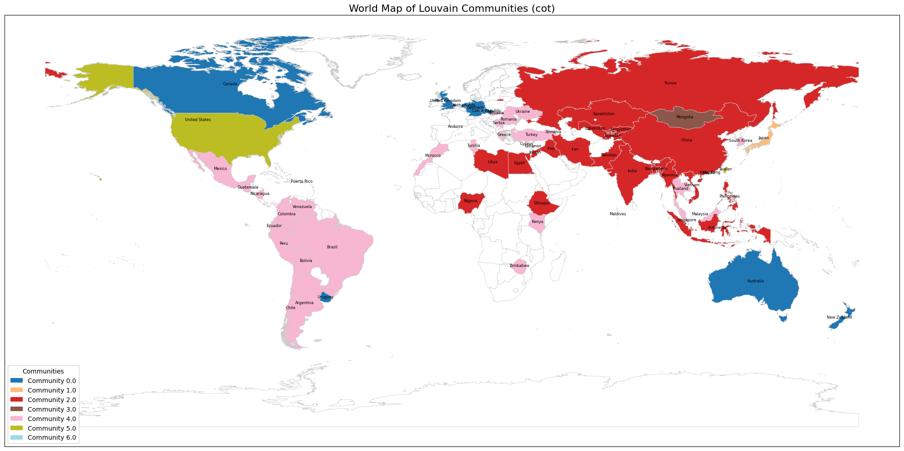

*Figure 24-2: Geographic distribution of error communities (Chain-of-Thought). Colors indicate shared error patterns. Notice how culturally distinct (but closer in terms of geopolitics) countries (e.g. China, SE Asian Ccountries, Middle East, and Russia) share communities.*

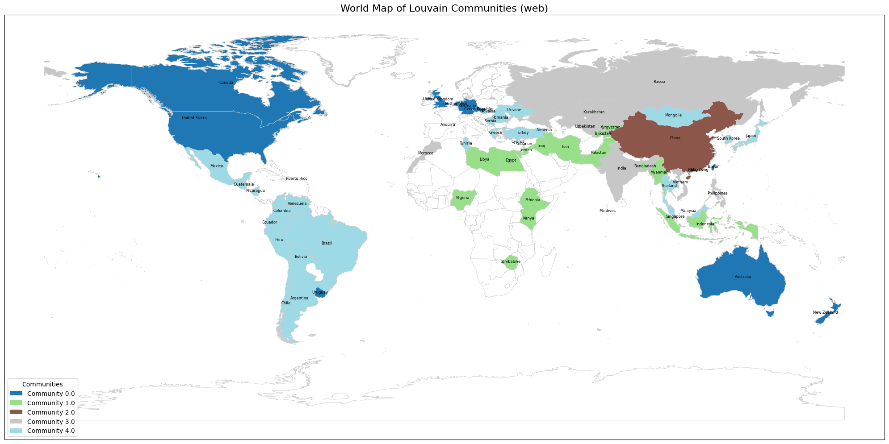

*Figure 24-3: Geographic distribution of error communities (Web-search Enabled Agnet). Colors indicate shared error patterns.*

------------------------------------------------------------------------

### Running the Pipeline on All Three Methods

We execute the pipeline for simple prompting, chain-of-thought, and web-search to compare how prompting strategies restructure error communities:

``` python
# Process all three methods
all_methods = {'simple': simple_diff, 'cot': cot_diff, 'web': web_diff}
results = {}

for method, df_diff in all_methods.items():
    print(f"\n=== Analyzing {method} ===")
    results[method] = run_error_community_pipeline(df_diff, method)
    print(f"Modularity: {results[method][4]:.3f}")
    print(f"Communities detected: {len(set(results[method][3].values()))}")
```

**Output summary:**

-   **Simple prompting**: 5-6 communities, modularity = 0.425

-   **Chain-of-thought**: 6-7 communities, modularity = 0.375

-   **Web-search**: 4-5 communities, modularity = 0.407

The modularity scores tell us that **simple prompting produces the clearest community structure**, while **chain-of-thought somewhat blurs** cultural boundaries.

------------------------------------------------------------------------

## What We Discovered: Latent “Error Cultures”

The communities we detected represent **latent “error cultures”** in the model—groups of countries where GPT-5 makes similar mistakes. These aren't random groupings. They reveal the model's internal cultural taxonomies: how it mentally categorizes countries when reasoning about values and beliefs.

### Modularity Scores: How Strong Are These Clusters?

The modularity scores tell us whether detected communities are **meaningful or arbitrary**:

-   **Simple prompting**: Modularity = 0.425
-   **Chain-of-thought**: Modularity = 0.375
-   **Web-search agent**: Modularity = 0.407

**Interpretation**: Modularity between 0.3–0.5 indicates **moderate but meaningful community structure**—not random noise, but also not rigid divisions. The model exhibits systematic differences in reasoning across country groups, though boundaries are somewhat fluid.

**Key finding**: Simple prompting produces the **clearest cultural stratification** (highest modularity). Chain-of-thought weakens this structure (lowest modularity), suggesting that explicit reasoning **homogenizes** the model's error patterns. Web-search falls in between.

------------------------------------------------------------------------

### Five Stable Communities: The Model's Core Cultural Taxonomy

Some communities appear **consistently across all three prompting methods**, suggesting these are robust latent representations deeply embedded in the model. These stable clusters reveal GPT-5's fundamental understanding of global cultural geography.

#### Community A: Western Liberal Democracies

**Members**: Canada, UK, Netherlands, Australia, Germany, New Zealand, Andorra, Uruguay (sometimes US, Czech Republic)

**Stability**: Appears in all three methods with minimal membership changes

**Interpretation**: The model treats these countries as a unified bloc—institutionally similar societies characterized by democratic governance, high-income OECD status, and liberal social values. When predicting cultural attitudes, GPT-5 applies the same template to all members: assumes similar views on gender equality, democracy, individual rights, and secular institutions.

**Why this matters**: This clustering reveals the model's **Western-centric framing**. It groups Uruguay (Latin America) with European countries based on democratic institutions, ignoring regional cultural distinctions. The US sometimes falls **outside** this cluster, suggesting the model's representation of America is unstable and context-dependent.

------------------------------------------------------------------------

#### Community B: Global South / Development Cluster

**Members**: Indonesia, Pakistan, Iran, Bangladesh, Egypt, Iraq, Nigeria, Ethiopia, Jordan

**Stability**: Large, consistent cluster across all methods

**Interpretation**: The model collapses many **culturally diverse developing countries** into a single pattern. These countries span different continents, religions (Muslim-majority Middle East, Christian-majority Ethiopia, diverse Southeast Asia), and political systems—yet the model treats them as interchangeable.

**Why this matters**: This is a **stereotyping failure**. The model likely has **sparse training signals** for these contexts and falls back on broad "developing world" assumptions. It misses the vast differences between, say, Confucian-influenced Indonesia and Arab-Islamic Egypt. This pattern is common in AI systems trained predominantly on Western data.

------------------------------------------------------------------------

#### Community C: Chinese Cultural Sphere

**Members**: China, Hong Kong, Singapore, Macao (sometimes Vietnam)

**Stability**: Extremely consistent—the **most stable cluster** across all methods

**Interpretation**: The model powerfully groups Chinese-influenced societies together, recognizing shared Confucian heritage, historical connections, and (for some) linguistic ties. This community persists even when economic systems differ drastically (authoritarian China vs. capitalist Singapore).

**Why this matters**: This is one of the few **non-Western** clusters the model recognizes distinctly. It suggests GPT-5 has encoded specific knowledge about East Asian cultural patterns, likely due to extensive Chinese-language content in training data. However, the cluster's rigidity means the model may **over-apply** Chinese templates to diverse societies like Singapore (which is multiethnic) or Hong Kong (which has distinct political culture).

------------------------------------------------------------------------

#### Community D: Japan as Perpetual Singleton

**Members**: Japan (alone)

**Stability**: Forms its own singleton community in multiple runs

**Interpretation**: Japan's error patterns are **so distinct** that it doesn't fit any regional cluster. The model treats Japanese culture as fundamentally different from both Western democracies and East Asian neighbors.

**Why this matters**: Singleton communities indicate the model either (1) has **highly specific knowledge** about a country, or (2) has **deeply confused representations** that don't align with any template. For Japan, it's likely both: extensive training data creates specific priors, but these priors may be **stereotyped** (samurai, anime, work culture) rather than reflecting contemporary survey data.

------------------------------------------------------------------------

#### Community E: Method-Dependent Clusters

Beyond these stable cores, other communities shift depending on prompting strategy:

**Eastern Europe** (Poland, Romania, Slovakia, Czech Republic): Clusters together in simple and web-search methods, but **fragments** under chain-of-thought.

**Latin America** (Mexico, Brazil, Argentina, Chile): Forms coherent community with CoT and web-search, but **mixes** with other regions under simple prompting.

**Middle East/North Africa**: Emerges as distinct community primarily with **web-search**, suggesting external information helps separate Arab cultural patterns from the broader Global South cluster.

**Interpretation**: These method-dependent clusters show how **prompting strategy activates different latent representations**. Simple prompting reveals training-data stereotypes. Web-search grounds responses in geopolitical knowledge. CoT introduces generic reasoning that can either sharpen or blur cultural boundaries.

------------------------------------------------------------------------

## How Prompting Strategies Reshape Cultural Space

The same model, the same data—but different prompting methods produce **fundamentally different cultural clusterings**. This reveals that prompting doesn't just improve or degrade performance; it **changes which cultural knowledge the model accesses**.

### Simple Prompting: Training Data Stereotypes

Simple prompting produces 5-6 distinct clusters with clear boundaries and the highest modularity score (0.425), representing the clearest cultural stratification. The resulting map shows a tight Western democracy cluster, a large but undifferentiated Global South community, distinct East Asian subclusters, and Latin America mixed with other middle-income countries.

This pattern reveals something important: direct prompting accesses the model's latent cultural priors—the stereotypes and patterns absorbed during training that reflect how countries are co-mentioned and framed in the training corpus. The model has strong, clear templates for cultures heavily represented in English-language internet data (Western democracies, East Asia). For under-represented regions, it defaults to broad generalizations, lumping diverse developing countries together into an amorphous "other" category.

The implication is significant: simple prompting gives us the most honest view of what the model has truly learned about cultural geography—biases and all. This is the model's unfiltered understanding, shaped entirely by training data patterns rather than explicit reasoning or external information.

------------------------------------------------------------------------

### Chain-of-Thought: Homogenization Through Reasoning

Chain-of-thought reasoning produces 6-7 communities but with much more overlap and the lowest modularity score (0.375), fundamentally weakening community structure. The resulting map shows many countries forming a huge mixed cluster that spans Latin America, Southeast Asia, Eastern Europe, and the Middle East. More singleton communities emerge (Japan, Mongolia), and the clear separation between Western and non-Western countries blurs significantly.

This pattern reveals a critical mechanism: when asked to reason step-by-step about "social conditions, cultural norms, and everyday experiences," the model converges on generic reasoning templates that override specific cultural priors. For example, CoT might reason: "This is a developing country → People prioritize economic security → Trust in institutions is moderate → Social values are traditional." This logical chain produces similar predictions for very different countries, collapsing distinct error patterns into homogeneous categories.

The implication is troubling: explicit reasoning erases cultural specificity. The model becomes more "logical" but less culturally authentic. This matches the drop in modularity—boundaries blur as reasoning homogenizes responses across diverse contexts.

------------------------------------------------------------------------

### Web-Search: Geopolitical Realignment

Web-search produces 4-5 communities with clearer geopolitical logic and medium modularity (0.407), falling between simple prompting and chain-of-thought. The resulting communities better align with real-world geopolitical relationships: Western democracies (now including the US more consistently), Middle East/North Africa (separated from the broader Global South), the stable Chinese cultural sphere, mixed emerging economies, and a Russia–India–Central Asia group.

This pattern reveals how external information reshapes internal representations: access to Wikipedia restructures error patterns according to external information rather than training stereotypes alone. The model no longer relies solely on latent priors; it incorporates recent survey data, policy information, and geopolitical framing from searchable sources. For example, web-search might retrieve: "Recent Eurobarometer shows 65% of Spaniards support..." This grounds the response in factual context, producing errors more aligned with real-world cultural-political blocs.

The implication highlights both promise and limitation: external information can partially correct training biases, but only for cultures with extensive Wikipedia coverage. Under-documented regions remain poorly represented, their error patterns still shaped more by stereotypes than by accessible facts.

------------------------------------------------------------------------

## Validating Community Coherence

Finding communities is one thing—but are they actually meaningful? A critical question remains: Are countries within the same community genuinely more similar to each other than to countries in other communities, or has the algorithm simply imposed arbitrary divisions on continuous variation?

To answer this, we need a rigorous validation approach. For each detected community, we compute cosine similarity between all pairs of countries, then separate these measurements into two categories: **within-community pairs** (countries in the same cluster) and **between-community pairs** (countries in different clusters). If the communities are meaningful, we should see substantially higher average similarity within communities than between them.

This within-versus-between comparison provides a quantitative measure of cluster quality. Strong separation validates that the Louvain algorithm identified real structure in the error patterns rather than imposing artificial boundaries.

### Measuring Within-Community Coherence

The validation involves computing cosine similarity for all country pairs within each method's error patterns, then separating these into within-community pairs (countries in the same cluster) and between-community pairs (countries in different clusters). For each community, we calculate the average similarity within and between, producing quantitative measures of cluster coherence.

``` python
def compare_community_similarities(df_dict):
    """
    Compute within- vs between-community similarity for all methods.
    Returns results_dict mapping method -> DataFrame(community, within_mean, between_mean)
    """
    results_dict = {}
    for method, df_labeled in df_dict.items():
        features = df_labeled.drop(columns=['community']).values
        community_map = df_labeled['community'].values
        sim_matrix = cosine_similarity(features)

        community_scores = []
        for comm in np.unique(community_map):
            comm_idx = np.where(community_map == comm)[0]
            other_idx = np.where(community_map != comm)[0]

            within_pairs = list(combinations(comm_idx, 2))
            within_sims = [sim_matrix[i,j] for i,j in within_pairs] if within_pairs else [np.nan]
            between_pairs = [(i,j) for i in comm_idx for j in other_idx]
            between_sims = [sim_matrix[i,j] for i,j in between_pairs] if between_pairs else [np.nan]

            community_scores.append({
                "community": comm,
                "within_mean": np.mean(within_sims),
                "between_mean": np.mean(between_sims)
            })

        results_dict[method] = pd.DataFrame(community_scores)
    return results_dict
```

The visualization displays grouped bar charts for each method, showing within-community similarity (first bar) versus between-community similarity (second bar) for each detected community. Larger gaps between the bars indicate stronger, more cohesive clusters. The comparison across methods reveals how prompting strategies affect cluster quality.

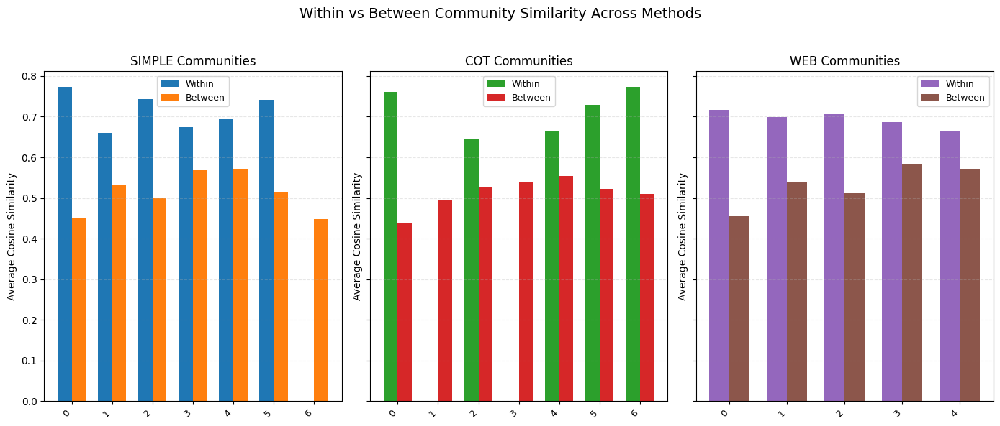

*Figure 25: Validation of community coherence. For each method and community, compare average within-community similarity (blue/green bars) to between-community similarity (orange/red bars). Larger gaps indicate well-separated, meaningful clusters. Simple prompting shows the largest gaps, chain-of-thought shows the smallest.*

#### What the Validation Numbers Reveal

These statistics measure how coherent each detected community actually is by comparing the average similarity between countries inside the same community (within_mean) to the average similarity between that community and all other countries (between_mean). If within-community similarity substantially exceeds between-community similarity, the cluster is well-separated and meaningful. If the two values are similar, the cluster is weak or fuzzy. Singleton communities (only one country) show NaN for within-community similarity since there are no internal pairs to compare.

**Simple Prompting: The Clearest Stratification**

Under simple prompting, many communities show large similarity gaps ranging from 0.20 to 0.32. Community 0, for instance, has an average within-community similarity of 0.773 compared to only 0.450 between-community—a gap of 0.323. This is remarkably strong clustering, indicating that countries within this community behave far more similarly to each other than to outsiders.

Multiple communities show this pattern: Communities 2 and 5 have gaps around 0.22-0.24, while Communities 1 and 4 show moderate separation of 0.12-0.13. Even the weaker clusters (like Community 3 with a 0.106 gap) still demonstrate measurable separation. Only Community 6 is a singleton (likely Japan), showing no within-community comparison.

This pattern confirms that simple prompting produces clear cultural segmentation of model errors. The model relies heavily on pretrained cultural priors—stereotypes and patterns absorbed during training—leading to distinct, well-separated error communities that map onto recognizable geopolitical groupings.

**Chain-of-Thought: Weaker Boundaries, More Outliers**

Chain-of-thought reasoning fundamentally changes this picture. Two striking patterns emerge: more singleton communities and much weaker cluster separation. Japan and Mongolia now form individual communities, indicating outlier reasoning behavior where the model's step-by-step logic produces unique error patterns that don't fit regional templates.

Among the remaining multi-country communities, many show weak separation. Community 4, for example, has within-community similarity of 0.664 versus between-community similarity of 0.555—a gap of only 0.109. This means countries inside the cluster are barely more similar to each other than to countries outside it. The model essentially treats them almost interchangeably.

Even the strongest cluster (Community 0, gap of 0.321) stands alone; most others have gaps around 0.10-0.20, far below simple prompting's typical values. This pattern confirms that chain-of-thought blurs cultural differences. The reasoning process pushes the model toward generic reasoning templates—logical frameworks that apply broadly across contexts—reducing reliance on region-specific priors. This aligns with the lower overall modularity score.

**Web-Search: Selective Reorganization**

Web-search agents produce an intermediate pattern. One community shows very strong cohesion: Community 0 (likely Western democracies) has a gap of 0.261 (0.716 within vs. 0.455 between), indicating a tight, well-defined cluster. However, other communities show much weaker separation, with gaps around 0.10-0.20.

Community 3, for instance, has minimal separation (0.687 within vs. 0.583 between, gap of only 0.104), meaning it's loosely defined. These mixed results suggest that web search partially reorganizes error similarity—strong geopolitical clusters emerge where Wikipedia coverage is rich and coherent, but many countries become more mixed in regions where external information is sparse or contradictory. The agent uses external information unevenly, benefiting well-documented cultural regions while leaving others ambiguous.

------------------------------------------------------------------------

**Comparing Across Methods**

When we look at cluster strength across all three prompting strategies, a clear hierarchy emerges. Simple prompting produces the strongest, most culturally segmented error patterns. Chain-of-thought reasoning generates the weakest structure, with homogenized reasoning that blurs regional distinctions. Web-search agents fall in between, creating geopolitically structured but somewhat mixed communities.

This progression reveals the interplay between different sources of knowledge in the model. Simple prompting exposes latent training priors in their purest form. Chain-of-thought reasoning pushes the model toward generic logical templates that reduce reliance on cultural stereotypes. Web search introduces external knowledge that creates new structure aligned with real-world geopolitical relationships.

**Why These Gaps Matter**

The within-between similarity gaps provide crucial methodological validation: they confirm that the detected communities are not statistical artifacts of the clustering algorithm. When we see separation as large as 0.323 (Community 0 under simple prompting), we're observing genuinely cohesive clusters. Such large gaps are uncommon in similarity networks and indicate that countries within these communities truly share distinctive error patterns.

However, not all clusters are equally well-defined. Some communities show remarkably small separation—as little as 0.104 (Community 3 under web-search). In these cases, countries inside the cluster are nearly as similar to outside countries as they are to their cluster-mates. The model essentially treats these countries almost interchangeably, suggesting ambiguous or contradictory internal representations. These weakly separated clusters likely correspond to mixed geopolitical regions where the model lacks clear cultural priors.

**The Big Picture**

Synthesizing these findings: Communities detected under simple prompting exhibit strong internal cohesion, revealing clear clustering of model error patterns by macro-cultural region. Chain-of-thought reasoning weakens this separation, producing diffuse communities and singleton outliers as step-by-step reasoning homogenizes responses. Web-search agents restore some structure but yield more mixed clusters, suggesting that external information partially reshapes but cannot fully override the model's latent cultural priors.

### Characterizing Communities by Their Distinctive Errors

Validating that communities are internally coherent is essential, but it doesn't tell us *what makes each community unique*. To understand the cultural fingerprints of each cluster, we need to identify which survey items each community systematically gets wrong—and which items they get right when other communities fail.

This turns out to be trickier than it sounds. An initial attempt using TF-IDF (a text mining technique) failed because it simply nominated globally difficult or easy items rather than community-specific patterns. Similarly, within-between cosine similarity showed only modest gaps. The breakthrough came from treating this as an **in-group versus out-group comparison**: for each community, compute its error rate on every survey item, then compare that to the average error rate across all other communities.

The method is elegantly simple: compute the absolute difference in error rates between a community and everyone else. Large positive differences reveal items where the community struggles uniquely; large negative differences highlight items where the community excels while others fail. These distinctive strengths and weaknesses form each community's cultural error profile.

The implementation involves two key functions. First, we compute error rates for each community on each survey item:

``` python
def compute_community_error_rates(df_binary_with_comm):
    """Compute error rate per community per survey item."""
    community_counts = (
        df_binary_with_comm
        .drop(columns="community")
        .abs()
        .groupby(df_binary_with_comm["community"])
        .sum()
    )
    error_rates = community_counts / df_binary_with_comm.groupby("community").size().values[:, None]
    return error_rates, community_counts
```

Then we identify each community's distinctive patterns by comparing its error rates to all other communities:

``` python
def characterize_communities(error_rates, community_counts, partition_dict,
                            code2text=None, top_n=10):
    """
    Find survey items where each community's error rate differs most from others.

    For each community, compute the gap between its error rate and the average
    error rate across all other communities. Large positive gaps = weaknesses
    (items this community struggles with). Large negative gaps = strengths
    (items others struggle with more).
    """
    reversed_dict = {}
    for country, comm_id in partition_dict.items():
        reversed_dict.setdefault(comm_id, []).append(country)

    results = {}

    for comm_id, members in reversed_dict.items():
        # Compare this community's error rates to all others
        comm_errors = error_rates.loc[comm_id]
        others_errors = error_rates.drop(comm_id).mean()

        # Positive gap = community worse; negative gap = community better
        gap = comm_errors - others_errors

        results[comm_id] = {
            "weaknesses": gap.nlargest(top_n),      # Largest positive gaps
            "strengths": gap.nsmallest(top_n),      # Largest negative gaps
            "error_rates_comm": comm_errors,
            "error_rates_others": others_errors,
            "members": members,
            "overall_error_rate": community_counts.loc[comm_id].sum() /
                                  (len(members) * len(community_counts.columns))
        }

    return results
```

For each community, this produces a profile showing its distinctive error patterns. We visualize these using diverging bar charts where red bars indicate weaknesses (items this community gets wrong more often than others) and blue bars indicate strengths (items others struggle with while this community succeeds). The visualization displays the top 10 items in each direction, showing both the gap magnitude and the actual error rates for comparison.

``` python
# Run the full analysis pipeline
error_rates, community_counts = compute_community_error_rates(df_binary_with_comm)
results = characterize_communities(error_rates, community_counts, partition_dict,
                                   code2text=code2text, top_n=10)
```

### What the Error Profiles Reveal

#### Simple Prompting: Pure Cultural Stereotypes

#### Chain-of-Thought: Persistent Cultural Templates

#### Web-Search Agents: External Information Reshapes But Doesn't Resolve Biases

##### Example: Western Liberal Democracies v.s. Chinese Cultural Sphere

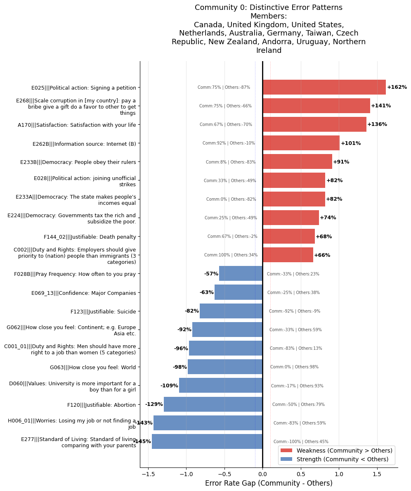

*Figure 26: Western Liberal Democracies Distinctive Error Patterns*

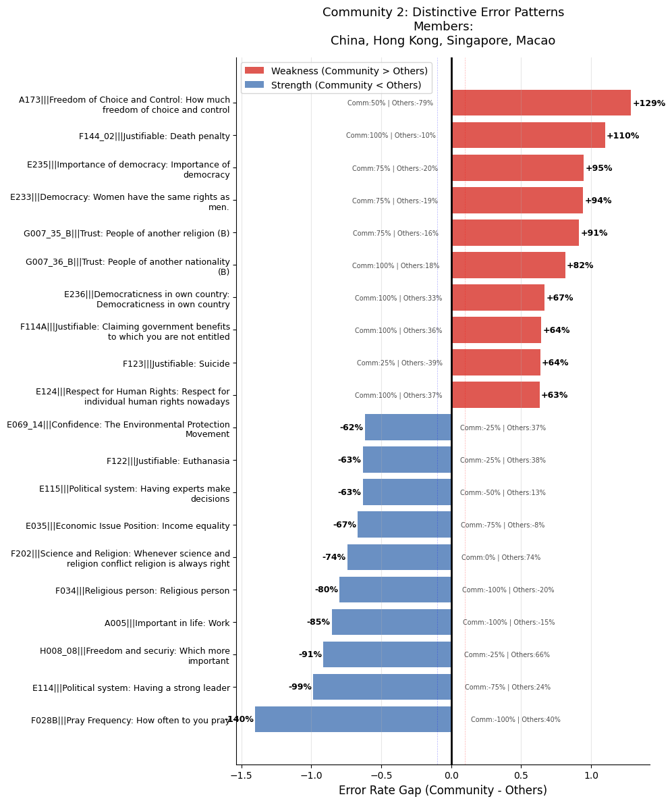

*Figure 27: The Chinese Cultural Sphere Distinctive Error Patterns*

Looking at the error patterns for these two communities in web-search agent's result, we identify the following:

1.  Opposite Cultural Stereotypes:

    Western cluster: Model fails on progressive social attitudes but succeeds on understanding rejection of authoritarianism Chinese cluster: Model fails on work ethic/secularism but succeeds on gender equality attitudes

2.  100% vs 0% Errors Signal Systematic Bias:

    Chinese sphere: 100% error on work importance, religiosity, foreign trust Western cluster: 0% error on men's job priority (in opposite community!)

3.  The "Template Inversion":

    What Western countries get RIGHT (authoritarian resistance), Chinese sphere doesn't struggle with What Chinese sphere gets RIGHT (gender equality), Western countries struggle with This shows the model applies inverse stereotypes to different regions

#### Key Revelations: Comparing the Three Methods

-   **Stable Core Communities = Structural Bias**. Across all three methods, the same core communities emerge: Western democracies, East Asia, Global South, former Soviet states. While boundaries shift slightly—CoT creates singleton outliers like Japan and Mongolia, web-search merges some clusters—the fundamental groupings remain. This reveals that LLM cultural representations are structured along geopolitical fault lines, not random noise. The model has internalized a systematic worldview.

-   **Extreme Disadvantages = Deep Blindspots**. The most severe errors are telling. Western cluster: +144% disadvantage on "signing a petition" (77.8% error vs -66.5% for others). Global South: +107% on prayer frequency. East Asian cluster: +86% on political discussions. These aren't minor inaccuracies—they're total representational failures. The model fundamentally misunderstands how specific cultural communities engage with civic life, religion, and political discourse.

-   **Inverse Stereotypes = Systematic Misrepresentation**. What one community gets catastrophically wrong, another handles well. When Western democracies show +144% disadvantage on petition-signing, other communities show negative errors. When Global South shows +107% disadvantage on prayer frequency, others perform better. This confirms the errors aren't random—they're complementary. The model has encoded opposing stereotypes for different cultural regions.

-   **Chain-of-Thought Creates Outliers, Not Solutions**. CoT prompting doesn't fix biases—it reorganizes them. Japan and Mongolia become singleton communities under CoT, indicating the model treats them as cultural outliers requiring special reasoning. Taiwan pairs with the US instead of East Asia. This shows CoT changes how the model articulates cultural knowledge, but the underlying stereotypes persist. Same errors, different clustering.

-   **Universal Struggles Reveal Model Limitations**. Some items defeat all communities: abortion justifiability, prayer frequency, job worries, standard of living concerns. These topics consistently show high error rates regardless of community or method. This suggests certain cultural dimensions are fundamentally underrepresented in the model's training data—or the concepts themselves resist the model's reasoning frameworks.

-   **Web-Search Doesn't Resolve Core Biases**. Despite accessing external information, the web-search agent shows similar community structures and extreme disadvantages. Western cluster still struggles with petition-signing. Global South still fails on prayer frequency. The error patterns compress slightly (5 communities instead of 7), but the fundamental misrepresentations persist. External retrieval can't override internalized stereotypes.

-   **Negative Overall Error Rates = Systematic Over-Prediction**. All communities show negative overall error rates (-8% to -20%), meaning the model systematically over-predicts agreement across questions. This isn't balanced by the comparative disadvantages—it's a separate, universal bias. The model defaults to "yes, people agree with this" regardless of cultural context, then applies community-specific distortions on top of that baseline.

## Item-Level Improvement and Degradation

The community-level analysis revealed how error patterns cluster by region and prompting strategy. But a complementary question remains: How do different prompting methods affect *specific survey items*? Some questions might benefit universally from chain-of-thought reasoning or web search, while others might actually get worse. Understanding these item-level patterns can reveal which types of cultural knowledge respond to enhanced prompting and which remain stubbornly resistant.

We ask four key questions: (1) Which items improve when using CoT or web search versus simple prompting? (2) Which items degrade? (3) Are there items that consistently improve or degrade across most countries? (4) What characteristics make an item benefit from enhanced prompting?

**The Method**

For each survey item, we compare error magnitudes between simple prompting and the enhanced methods (CoT or web search). Specifically, we compute the absolute error for each country-item pair, then calculate the difference: \|simple error\| - \|other method error\|. A positive difference indicates improvement (error decreased), while a negative difference indicates degradation (error increased).

To focus on meaningful changes, we use a threshold of 0.2—consistent with our earlier error coding—to filter out trivial fluctuations. For each item, we then count how many countries show improvement, how many show degradation, and how many show no substantial change. Items can be classified as **improvement-only** (helps everywhere it changes), **degradation-only** (hurts everywhere it changes), or **mixed** (helps some countries, hurts others).

The implementation computes improvement/degradation statistics for each item:

``` python
def item_level_change(simple_diff, other_diff, threshold=0.2):
    """
    Compare error magnitudes between simple and another method.
    Returns statistics on which items improve/degrade and by how much.
    """
    simple_err = simple_diff.abs()
    other_err = other_diff.abs()
    delta = simple_err - other_err  # Positive = improvement

    # Filter for meaningful changes (|delta| >= threshold)
    valid = delta.where(delta.abs() >= threshold)
    improve = valid.where(valid > 0)
    degrade = valid.where(valid < 0)

    return pd.DataFrame({
        "improvement_mean": improve.mean(axis=0),
        "degradation_mean": degrade.mean(axis=0),
        "win_count": improve.count(axis=0),
        "loss_count": degrade.count(axis=0),
        "win_rate": improve.count(axis=0) / (improve.count(axis=0) + degrade.count(axis=0))
    })
```

We then classify items into three categories based on their cross-country behavior: improvement-only (win_count \> 0, loss_count = 0), degradation-only (loss_count \> 0, win_count = 0), or mixed (both present). Visualizations plot average improvement magnitude against degradation magnitude for each item, with bubble size indicating how many countries show meaningful change.

### What Chain-of-Thought Improves—and What It Hurts

Chain-of-thought reasoning shows a stark divide in its effects. **Improvement-only items** cluster around normative, policy, and civic topics where explicit reasoning helps the model articulate complex positions. Questions about immigration employment priorities, gendered educational norms, future societal value shifts, and government economic responsibility all benefit from step-by-step reasoning. The model appears better able to navigate trade-offs (like freedom versus security), assess abstract concepts (global connectedness), and reason about political engagement when it can break down the problem into logical steps.

The pattern suggests that chain-of-thought works best on questions requiring **structured argumentation about social norms or abstract societal values**. These are precisely the kinds of items where explicit reasoning can help the model move beyond simple pattern matching to more sophisticated inference.

But the **degradation-only items** tell an equally important story. Chain-of-thought consistently hurts performance on trust-based questions (especially trust in strangers—showing degradation of -0.48), personal and familial values (making parents proud), subjective worries (children’s education), media behavior (internet and newspaper usage), institutional confidence (labor unions, major companies), and abstract identity measures (continental belonging). These items span subjective well-being, culturally embedded values, and context-dependent institutional trust.

The problem appears to be **over-reasoning**. When faced with questions about lived experiences, personal priorities, or culturally specific social trust, the model’s explicit reasoning chains lead it astray. It may overgeneralize, introduce assumptions that don’t match local contexts, or simply overthink questions where the answer depends on implicit cultural knowledge rather than explicit logic. A question like "one of my main goals in life has been to make my parents proud" doesn’t benefit from step-by-step reasoning—it requires understanding the cultural weight of filial duty, which explicit reasoning cannot recover.

The overall pattern for chain-of-thought is clear: it improves normative and civic reasoning where logical structure helps, but degrades subjective, trust-based, and culturally nuanced questions where reasoning chains overcomplicate or misinterpret social context.

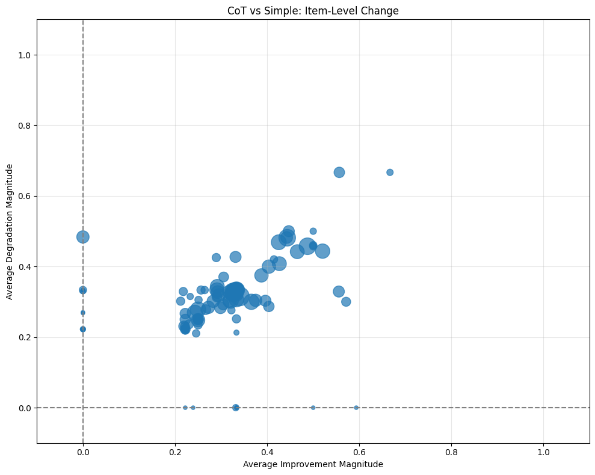

*Figure 28: Chain-of-Thought Improvement Degradation Scatterplot*

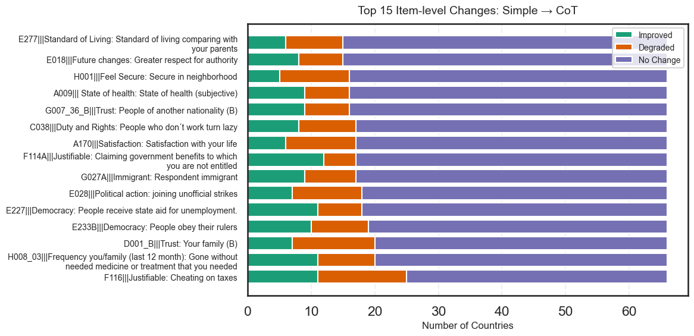

*Figure 29: Chain-of-Thought Improvement Degradation Top 15 by Magnitude of Change*

### What Web Search Improves—and What It Hurts

Web-search agents show a different improvement profile than chain-of-thought. **Improvement-only items** concentrate on questions where external information provides factual grounding or contextual evidence. Questions about sensitive ethical issues (suicide, abortion), social information behaviors (talking with friends), civic participation (demonstrations), financial hardship, freedom-versus-equality trade-offs, gendered education norms, confidence in political parties, government economic responsibility, religious service attendance, environment-versus-growth trade-offs, immigrant impact, personal priority goals, and global connectedness all benefit from web search.

The pattern reveals that web search helps most on **ethical dilemmas, civic engagement, and policy trade-offs** where the model can access real-world examples, policy debates, statistics, and societal norms. Questions requiring knowledge of contemporary political stances, social trends, or comparative national contexts improve because the model can ground its predictions in searchable information rather than relying solely on training data patterns.

But **degradation-only items** expose the limits of external search. Questions about duty to have children, confidence in major companies, personal food insecurity, trust in strangers, and newspaper usage all worsen with web search enabled. The problem appears to be **overfitting to generalized or non-local information**. When the model searches for information about these topics, it may encounter global narratives, statistical aggregates, or normative discussions that don’t match the specific cultural contexts being assessed.

Trust in strangers, for instance, varies dramatically by local social norms and lived experiences—aspects poorly captured in searchable web content. Similarly, questions about personal hardship or family security depend on intimate knowledge of economic conditions and social safety nets that general web searches cannot reliably provide. The model may find information, but it’s the wrong kind of information—too abstract, too generalized, or misaligned with the specific national context.

The overall pattern for web-search agents is instructive: **improvements concentrate in ethical reasoning, civic engagement, policy trade-offs, and social perspectives** where factual information helps. **Degradations concentrate in personal experiences, trust-based judgments, and culturally specific domains** where external information overwhelms or misguides local reasoning. Web search provides knowledge, but not wisdom about which knowledge applies where.

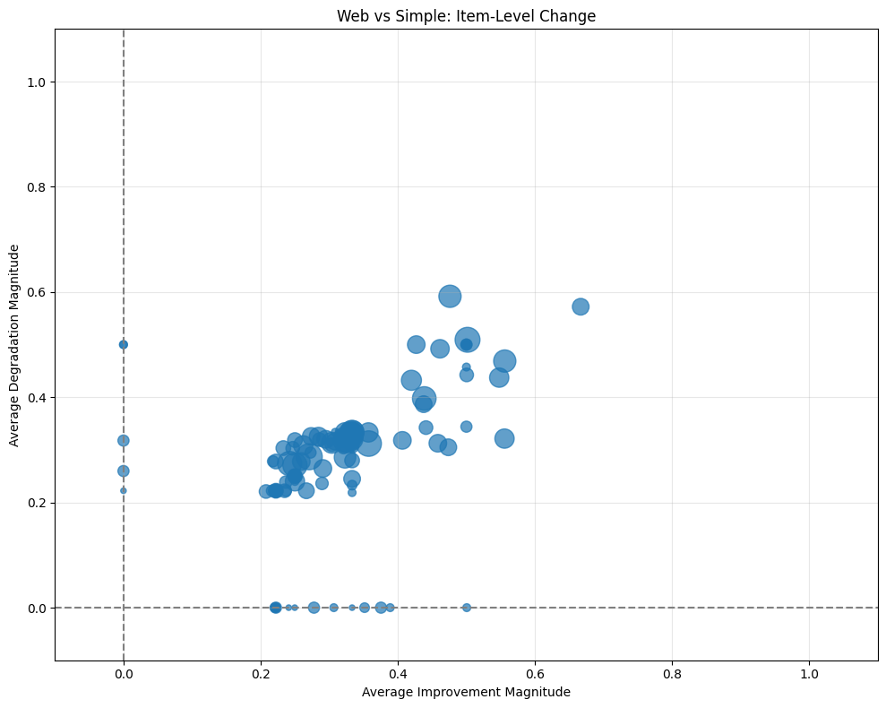

*Figure 30: Web-search Improvement Degradation Scatterplot*

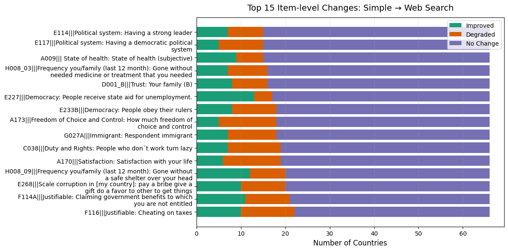

*Figure 30: Web-search Improvement Degradation Top 15 by Magnitude of Change*

------------------------------------------------------------------------

### Cross-Country Patterns: Which Items Change Most Consistently?

Beyond identifying improvement-only and degradation-only items, we can examine which items show the *most widespread* effects across countries. For each item, we classify every country as showing improvement, degradation, or no change, then visualize the distribution:

``` python
def classify_country_item_changes(simple_diff, other_diff, threshold=0.2):
    """Classify each country-item pair as improved (+1), degraded (-1), or unchanged (0)."""
    delta = simple_diff.abs() - other_diff.abs()
    return pd.DataFrame(
        np.select([delta >= threshold, delta <= -threshold], [1, -1], default=0),
        index=simple_diff.index, columns=simple_diff.columns
    )

def summarize_item_changes(df_class):
    """Count how many countries show improvement/degradation/no change per item."""
    return pd.DataFrame({
        "improved": (df_class == 1).sum(axis=0),
        "degraded": (df_class == -1).sum(axis=0),
        "no_change": (df_class == 0).sum(axis=0),
        "frac_improved": (df_class == 1).mean(axis=0),
        "frac_degraded": (df_class == -1).mean(axis=0)
    })
```

Visualizations show stacked horizontal bars for the top items with the most total change (improved + degraded countries), with segments colored to indicate the proportion showing improvement (green), degradation (orange), and no change (purple). This reveals which items have the widest cross-national impact from enhanced prompting.

### Chain-of-Thought: Redistribution Rather Than Correction

When we examine cross-country patterns, chain-of-thought produces a striking result: mixed effects rather than consistent improvement. For many items, the fraction of countries showing degradation is comparable to or even higher than those showing improvement. This suggests that step-by-step reasoning **redistributes errors** rather than systematically correcting them—it helps some countries while hurting others, depending on how the model’s reasoning interacts with specific cultural contexts.

The largest improvements occur on norm-evaluation questions involving rule violations or welfare provisions. Items like "claiming government benefits fraudulently" (18% of countries improved vs 8% degraded) and "state aid for unemployment" (17% vs 11%) show clear gains. Chain-of-thought appears to help the model apply explicit normative reasoning about fairness, welfare, and institutional rules—domains where logical argumentation can guide predictions.

But moral ambiguity creates instability. Questions about "cheating on taxes" show both substantial improvement and degradation (17% improved vs 21% degraded), indicating the model’s reasoning sometimes overgeneralizes moral logic while other times it corrects earlier errors. The direction of the effect depends on whether the reasoning aligns or conflicts with local cultural norms about tax compliance.

Trust-related questions consistently worsen. Items like trust in family and security in neighborhood show larger degradation rates than improvements, suggesting chain-of-thought struggles with contextual social trust judgments that depend on cultural priors rather than logical deduction. Similarly, subjective well-being indicators—life satisfaction, security, living standards compared to parents—show higher degradation rates, indicating that step-by-step reasoning adds noise when predicting experiential outcomes that don’t follow logical patterns.

Political participation and authority attitudes remain unstable. Items like joining unofficial strikes or respect for authority show nearly balanced improvement and degradation, suggesting chain-of-thought reasoning does not consistently improve predictions for political behavior. The overall pattern is clear: chain-of-thought helps most when the task involves explicit moral or institutional rules, but it often harms performance for subjective perceptions, trust, and lived-experience indicators where cultural knowledge rather than logical reasoning is required.

### Web-Search Agents: Evidence-Based Gains With Persistent Gaps

Web-search agents show a somewhat different pattern than chain-of-thought, with clearer gains in evidence-based reasoning but still fundamentally mixed results. Improvements and degradations are often similar in magnitude, meaning the tool helps in some countries but introduces errors in others—the same redistribution effect we saw with chain-of-thought.

The clearest gains come from concrete policy or rule-based questions. Items like "claiming government benefits fraudulently" (17% improved vs 15% degraded) and "state aid for unemployment" (20% improved vs 6% degraded) indicate that web search supports accuracy where external facts or norms can be directly retrieved. When the model can access specific policy information or institutional rules, it performs better.

However, subjective and personal well-being indicators often degrade. Questions about life satisfaction (9% improved vs 20% degraded) and freedom of choice/control (8% improved vs 20% degraded) show that retrieving factual information does not reliably help for subjective perceptions and may actually introduce confusion. The model finds external content about these topics, but that content doesn’t capture the lived experiences that survey responses reflect.

Moral or corruption-related items show moderate but inconsistent improvement. Questions like cheating on taxes (15% vs 18%) and bribes/gifts/favors (15% vs 15%) demonstrate that web search can clarify formal rules, but cultural variance in actual behavior limits its effectiveness, leading to balanced gains and losses. Trust and security measures remain unstable, with items like trust in family (12% improved vs 12% degraded) and gone without safe shelter (18% vs 12%) showing mixed results. Search can provide statistical context, but social nuance and local conditions are hard to capture through general web searches.

Political system perceptions prove particularly challenging. Items like "having a democratic system" and "having a strong leader" show more degradation than improvement, indicating web search may conflict with subjective or culturally embedded political attitudes. The information retrieved often reflects normative or international perspectives that don’t align with how people actually experience their political systems.

The overall pattern for web-search is clear: it improves performance mainly on objective, rule-based, or policy-related items—slightly better than chain-of-thought on some normative topics. But subjective well-being, trust, and culturally nuanced political perceptions remain challenging, often resulting in degradation. External information helps when facts matter, but not when lived experience and cultural context determine the answer.

## Key Findings: Error Analysis

This error analysis revealed five critical patterns about how LLMs misrepresent cultural values:

**1. LLM errors cluster by cultural region, revealing latent stereotypes** - Countries group into 5-6 communities based on *which* questions the model gets wrong (not *how often*) - Western democracies, Chinese sphere, Global South, and mixed middle-income clusters show distinctive error fingerprints - These clusters expose the model's mental categories for grouping countries

**2. Chain-of-thought doesn't fix cultural bias—it just articulates it differently** - Error profiles remain nearly identical between simple and CoT prompting - Same communities, same members, same weaknesses - CoT modifies *how* the model reasons, not *what* it knows about culture

**3. The "Principles vs. Practice" paradox** - Models understand abstract ideals (democracy, equality) but fail on actual social debates - Western cluster: 8% error on "obey rulers" but 92% error on suicide justifiability - This reveals shallow, template-based understanding rather than deep cultural knowledge

**4. Community-specific blindspots reveal inverse stereotypes** - What one community gets RIGHT, another gets WRONG - Western: 0% error on gender job equality; Chinese sphere: 100% error on work importance - These inverse patterns expose how the model applies contradictory templates to different regions

**5. Web search helps on facts, fails on feelings** - Improves policy/rule-based questions (unemployment benefits, immigration law) - Degrades on subjective perceptions (life satisfaction, trust in strangers) - External information provides knowledge but not wisdom about cultural context

------------------------------------------------------------------------

## What We've Learned: The Architecture of AI Cultural Bias

This deep dive into error patterns has revealed something fundamental about how large language models represent culture. The errors aren't random noise—they're systematic, clustered, and highly informative about the model's internal cultural taxonomies.

**Error communities reveal latent stereotypes.** When we detect communities based on error similarity, we're mapping the model's mental categories for grouping countries. Simple prompting exposes these categories in their rawest form: a handful of stable clusters (Western democracies, Chinese sphere, Global South) mixed with method-dependent groupings that shift based on how we prompt the model.

**Prompting strategies access different knowledge layers.** The same model produces fundamentally different cultural clusterings depending on whether we use simple prompts, chain-of-thought, or web-search. This isn't just about accuracy—it's about which representations the model activates. Simple prompting reveals training stereotypes. Chain-of-thought applies generic logical frameworks that homogenize cultural distinctions. Web-search grounds responses in external information, partially correcting biases for well-documented regions while leaving others underrepresented.

**Improvements and degradations are item-specific.** Enhanced prompting doesn't universally help or hurt. Chain-of-thought improves normative reasoning about policies and rules but degrades trust-based and subjective questions. Web-search helps on factual, evidence-based topics but struggles with lived experiences and culturally embedded attitudes. The pattern reveals a fundamental limitation: LLMs can reason and search, but they cannot access the tacit cultural knowledge that survey responses capture.

**Community validation confirms real structure.** The within-versus-between similarity analysis validates that these aren't statistical artifacts. Countries within communities truly share distinctive error profiles, with gaps as large as 0.3 in similarity scores. But not all clusters are equally well-defined—some are tight and coherent, others diffuse and mixed, revealing the uneven quality of the model's cultural representations.

The implications are sobering. These models encode systematic biases not as simple prejudices but as complex, multi-layered taxonomies that emerge through the interaction of training data, reasoning strategies, and external information retrieval. Understanding these error geographies is essential for anyone using LLMs to reason about human values, cultural differences, or social attitudes across societies.

------------------------------------------------------------------------

**Navigation**: [← Part 4: Agent Representation Performance](blog_part4_llm_representation_performance.md) \| \[Part 6: Conclusion →\]